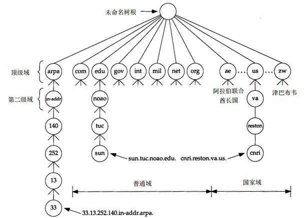
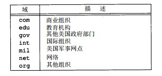
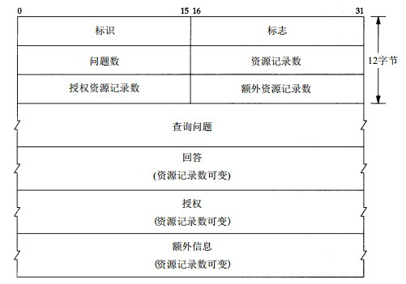
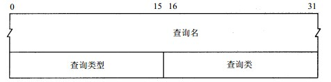
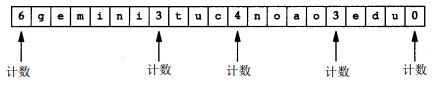
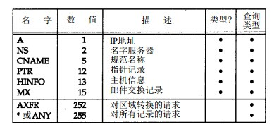
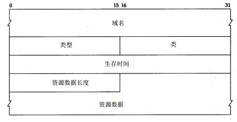

#DNS域名系统

域名系统（DNS）是一种用于TCP/IP应用程序的分布式数据库，它提供了主机名字和IP地址之间的装换以及有关电子邮件选路的信息。

在应用程序中，对DNS的访问是通过一个地址解析器来完成的。在Unix系统中，解析器通过调用gethostbyname和gethostbyaddr接口来访问（新的接口是getaddrinfo）。在编译应用程序的时候解析器会和应用程序连接在一起。

解析器通常是应用程序的一部分，解析器不像TCP/IP协议那样是处在操作系统的内核中，在一个应用程序请求TCP建立一个连接或使用UDP发送一个数据报之前，应用程序必须将一个主机名转换为一个IP地址，操作系统内核中的TCP/IP协议族对DNS并不了解。

##DNS基础

DNS的名字空间和Unix的文件系统相似，也是具有层次结构的。

DNS名字空间中的每一个节点都是由至多63个字符长的标识组成的。这棵树的根节点是没有任何标识的特殊节点。

命名标识不区分大小写。命名树上的任何一个节点对应的域名就是从该节点到最高层的域名连接起来，每个节点使用点“.”进行分隔。（这点，和Unix的文件系统不同，Unix的路径是从根节点向下到叶子节点构建的，而DNS是从叶子节点回溯到根节点来构建的。）

以点“.”结尾的域名被称为绝对域名或者完全合格域名FQDN（Full Qualified Domain），如“sun.tuc.noao.edu.”，如果一个域名不是以点“.”结尾的，则认为该域名是不完全的。如果不完整的域名由两个或者两个以上的标号组成，则认为它是完整的，或者在该域名的右边加入一个局部后缀。如：域名sun通过加上局部后缀.tuc.noao.edu.成为完整的。

其中顶级域被分为三个部分：

1. arpa域是一个用作地址到名字转换的特殊域	    
2. 7个3字符长的普通域	    
3. 所有2字符长的域都是基于ISO3166中定义的国家代码，这些域称为国家域或地理域。	    

7个普通域的划分：

在DNS中，3字符长的普通域用于美国的组织机构，2字符长的国家域则用于每个国家。但并不绝对。

在DNS系统中，对于DNS中域名的授权，只有一个机构，网络信息中心NIC负责分配顶级域和委派其他指定地区域的授权机构。

一个独立管理的DNS子树称为一个区域，一个常见的区域是一个二级域，如noao.edu。许多二级域将它们的区域划分为更加小的区域。

一个名字服务器负责一个或多个区域。一个区域的管理者必须为该区域提供一个主名字和至少一个辅助名字服务器。主，辅名字服务器必须是独立和冗余的，以便当某一个名字服务器发生故障时不会影响该区域的名字服务器服务。

主，辅名字服务器的区别是，主服务器从磁盘中获取该区域的所有信息，而辅名字服务器则从主服务器调入所有的信息。而辅名字服务器从主服务器中获取信息的过程称为**区域传送**。

当一个名字服务器中不包含待请求的信息的时候，这个名字服务器必须通过和其他名字服务器进行交流来获得信息，但是，并不是所有的名字服务器都知道如何与其他服务器进行交流，相反，每个名字服务器必须要知道根服务器的位置，即每个名字服务器都包含了根服务器的IP地址，而根服务器则知道所有二级域名中的每个授权名字服务器的名字和位置（IP地址）。这样，名字服务器如果需要更多的信息，那么就会和根服务器进行通信，然后根服务器就会把另一个名字服务器的地址告诉这个名字服务器，让它和那个服务器进行通信。

DNS的一个基本特性是使用超高速缓存。当一个名字服务器收到相关映射关系的时候，它会将该信息存放在高速缓存中，如果在下次遇到同样的映射请求的时候，就可以通过高速缓存来获得，而不用每次都和其他名字服务器进行网络通信。

##DNS报文格式

DNS定义了一个用于查询和响应的报文格式：

DNS报文由12字节长的首部和4个长度不变的可变字段组成。

* 标识字段，标识字段占16-bits，由客户程序设置并被服务器返回。客户程序通过这个字段来判	断请求和应答是否匹配
* 标志字段，标志字段占据16-bits，这个字段被划分为若干个子字段：		
    	
    字段中的各个子字段从左往右分别为：
    * QR，占据1 bit，0表示查询报文，1表示响应报文
    * opcode，占据4 bits，通常为0（标准查询），其他值可以是1（反向查询）和2（服务器状态请求）
    * AA，占据1 bit，表示“授权回答”（Authoritative Answer），表示请求的这个名字服务器是被这个域所授权的。
    * TC，占据1 bit，表示“可截断的”（Truncated），使用UDP数据报协议时，它表示当应答总长度超过512字节时，只返回512字节。
    * RD，占据1 bit，表示“期望递归”（Recursion Desired），这一位能在一个查询中设置，并在响应中返回。这个标志告诉名字服务器必须处理这个查询，也称为递归查询。如果这一	位被设置为0，那么被请求的服务器如果没有一个授权回答，它就返回一个能解答该查询的其他名字服务器列表，这称为**迭代查询**，否则，名字服务器就会通过递归的方式查询，然后将结果返回给客户端。
    * RA，占据1 bit，表示“可用递归”，如果名字服务器支持递归查询，则在响应中将该位设置为1，一般情况下，名字服务器都支持这种递归查询，除了一些根服务器。
    * 最后的3 bits字段必须为0，作为填充。
    * rcode，占据4 bits，表示返回值字段，通常为0（没有差错）和3（名字差错）。名字差错只有从一个授权名字服务器上返回，它表示在查询中指定的域名不存在。
    * 4个16 bits的字段说明了下方包含了的4个可变长字段中包含的条目数。对于查询报文，问题数字段通常为1，而其他3项通常为0。类似的，对于应答报文，资源记录数至少为1，其他两项可以是0或非0。

###查询问题字段的格式

DNS协议格式中的可变字段中，包含了查询问题字段，该字段中的每一项的格式如下：

* 查询名字段，这个字段是一个或多个标识符的序列。每个标识符以计数值开始来说明随后标识符	的字节长度，每个名字都是以0结尾，长度为0的标识符是根标识符。计数字节的值必须是0~63的数，因为每个域名标识符的长度不能超过63。在这个字段中，不需要进行32-bits边界对齐。	    
    域名为gemini.tuc.noao.edu，在查询名字段中的存储：		
    		    
    DNS的查询名字字段，也可以使用压缩格式，在这种格式下，如果一个域名是压缩的，那么它的单字节计数字段的最高两位被设置为1，这表示它是一个16-bits的指针，而不是一个8-bits的计算字节。在指针中的剩下14-bits说明在该DNS报文中标识符所在的位置。只要有一个标识符是压缩的，那么就可以使用这种类型的指针。而不是一定要整个域名是压缩的才可以用。压缩的域名主要用于如果存在多个相同的域名的情况下，可以减少存储空间。

* 每个查询问题，都包含了一个查询类型，而每个响应（即资源记录）也有一个类型。大约有20个不同的类型值，常见的类型如下：
  	    
  其中，有两个类型只能用于查询。最常见的查询类型是A类型，表示期望获取的查询名的IP地址。一个PTR查询则会获得一个IP地址对应的域名，这又称为指针查询。

* 查询类，通常值为1，表示查询的是一个互联网地址。

###应答中的资源记录字段的格式

DNS报文中的最后3个可变字段：回答字段，授权字段和附加信息字段，都采用了同一种记录格式，即资源记录格式RR（Resource Record）。

* 域名字段记录了资源数据对应的名字，它的格式和的查询名字段格式相同。
* 类型字段说明RR的类型码，它的值和查询类型值一样，通常为1，指的是Internet数据。
* 生存时间字段是客户程序保留该资源记录的秒数。资源记录通常的生存时间为2天。
* 资源数据长度字段说明了资源数据的数量
* 资源数据保存了查询返回的数据，该数据的格式依赖于类型字段的值。对于类型1（A	记录）	资源数据是4字节的IP地址。

##指针查询

DNS中的指针查询，指的就是通过给定一个IP地址，返回该地址对应的域名。

对于一个DNS中的arpa顶级域，以及下方的二级域in-addr。当一个组织加入Internet，并获得DNS域名空间的授权，则它们也获得了对应IP地址的in-addr.arpa域名空间的授权。

比如一个域名noao.edu的网络号为140.255的B类网络，那么在DNS树中节点in-addr.arpa的下一级必须就是该IP地址的第一个字节（140），然后再下一级是该IP地址的下一个字节（255），依次类推。但是，由于DNS的名字是从DNS叶子节点回溯到根构建的，所以，这意味着对于一个IP地址为140.252.13.33的sun主机，它的DNS名字为*33.13.252.140.in-addr.arpa*。

必须写出4个字节的IP地址，因为授权的代表是基于网络号的：A类地址是第一个字节，B类地址是第一、二个字节，C类地址是第一、二、三字节。IP地址的第一个字节一定位于in-addr的下一级。

如果DNS树中没有独立的分支来处理这种**地址--名字转换**，那么将无法进行这种反向转换，除非从根开始尝试每个分支，但是这么做效率会很低。

##资源记录

不同类型的资源记录（RR）包括：IP地址查询使用A类型，指针查询使用PTR类型，等。

常见的资源类型如下：

* A	一个A记录定义了一个IP地址，它存储32-bits的二进制数据
* PTR	指针记录，用于指针查询。IP地址被看作是in-addr.arpa域下的一个域名
* CNAME	这表示“规范名字（Canonical Name）”。它表示一个域名，而有规范名字的域名通常被称为别名。
* HINFO	表示主机信息：包括说明主机CPU和操作系统的两个字符串，并不是所有的站点都提供它们的系统的HINFO记录，并且提供的信息可能不是最新的。
* MX	邮件交换记录，用于以下场合：
	* 一个没有连接到Internet的站点将一个连接到Internet的站点作为其邮件交换器。这两个站点能够通过一种交替的方式交换到达的邮件，而通常使用的协议是UUCP。
	* MX记录提供了一种将无法到达其目的主机的邮件传送到一个替代主机的方法
	* MX记录允许机构提供用于别人发送邮件的虚拟主机，即使这样的主机是虚拟的，实体主机并不存在。
	* 防火墙网关能够使用MX记录来限制外界和内部系统的连接。
	MX记录可以被连接到互联网中的邮件处理器使用，当一个邮件发送到一个主机的时候，如果存在MX记录，那么这个邮件就会被发送到一个用于交换的主机上。
	每一个MX记录被赋予一个16 bits的整数值，该值称为优先值，如果一个目的主机由多个MX记录，他们按优先级从小到大的顺序使用。
	还有一种情况是，主机脱机工作或不可达的情况下，邮件处理器仅仅在无法使用TCP和目的主机连接时才会使用MX记录。
* NS	名字服务器记录。它说明一个域的授权名字服务器，它由域名表示（通过字符串的方式）。

##高速缓存

为了减少Internet上的DNS通信量，所有的名字服务器都使用高速缓存。在Unix实现中，一般高速缓存都是由名字服务器而不是名字解析器来维护的。

默认情况下，名字解析器将在本地主机上（UDP端口号为53或TCP端口号为53）寻找名字服务器。

##DNS协议使用UDP协议还是TCP协议

DNS服务器同时支持TCP和UDP协议，使用端口号53。

一般情况下，查询和应答都是UDP协议的。但是，当返回的响应中的TC（截断）标志被设置为1的时候，意味着报文长度超过了512字节，但是由于被截断了，仅仅返回512字节，在这种情况下，名字解析器通常使用TCP来重发原来的查询报文，这就允许响应超过512字节。

此外，当一个域的辅助名字服务器在启动时，将从主名字服务器中获取数据，这将会进行区域传送操作。并且，辅助服务器也会定时（通常为3个小时）向主服务器查询来了解主服务器数据是否发生变动。如果有变动，将执行一次区域传送。区域传送将使用TCP协议进行，因为一次区域传送的数据流一般比一次查询和应答的数据量要大的多。

如果DNS服务器使用UDP协议，那么必须自己实现重传和超时机制。
