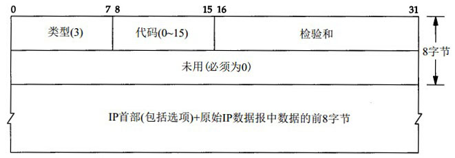

#ICMP不可达报文

ICMP的一个规则是，ICMP的差错报文必须包括产生该差错报文的数据报的IP首部，还必须至少包括跟在IP首部后面的数据部分的前8个字节。

在ICMP差错报文中需要返回产生ICMP差错的IP数据报的首部，这样做是因为IP首部中包含了协议字段，这些信息使得ICMP可以知道如何解释ICMP差错报文中包含的原来IP数据报数据部分的前8个字节的数据。

ICMP不可达报文的一般格式：

ICMP不可达报文有16种不同的类型，代码分别从0到15。另外，需要注意的是，尽管ICMP不可达报文的第二个32-bits字必须填充为0，但是当代码字段为4（需要分片，但IP的标志字段的DF标志被设置为1，即不能分片）的时候，路径MTU发现机制允许路由器把外出接口的MTU填充在这个32-bits字的低16-bits中。

##ICMP不可达差错（需要分片）

发生ICMP不可达差错的另一种情况是，当路由器收到一份需要分片的数据报，而该数据报在IP首部又设置DF标志。如果需要判断在两个主机之间的路径上的最小MTU，可以使用一种称为“路径MTU发现机制”的方法来确定，而这种差错可以用于这种机制。

由于需要分片而产生的不可达差错报文的格式如下：

.jpg "ICMP不可达差错\(需要分片\)")

这种情况下的不可达报文和其他类型的不可达报文的格式有些区别，在报文中的第二个32-bits字中，32-bits字的第16-bits部分16-31bits处用于存放产生这个差错报文的路由器到下一站路由器（本来是可以到达的那个路由器，但是由于不能分片而不能到达）上的路径上的MTU，而在一般的不可达报文中，这里是被填充为0的。如果一个路由器没有提供这种ICMP差错报文格式，那么在MTU字段设置为0。
