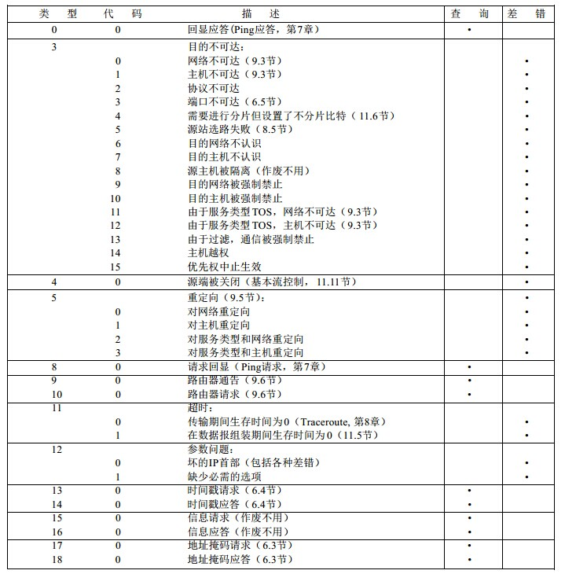

#ICMP: Internet控制报文协议

ICMP协议是IP层的一个组成部分，它传递差错报文以及其他需要的信息。ICMP报文通常被IP层或更高层协议使用，一些ICMP报文把差错报文返回给用户进程。

ICMP报文通过IP数据报进行传输：

ICMP报文的格式：

所有的ICMP报文的前4个字节都是一样的，但是剩下的其他字段的格式特定于不同的报文类型。

* 类型字段，占据8-bits，类型字段一共有15个不同的值，用于描述特定类型的ICMP报文。
* 代码字段，占据8-bits，代码字段用于区分同一个类型中不同的适用条件。
* 检验和字段，占据8-bits，检验和字段计算的时候覆盖了整个ICMP报文，计算方法和IP首部检验和计算方法一致。

##ICMP的报文类型

ICMP报文一共有15中报文类型，而一些报文类型中，又分为多个适用条件，通过类型字段和代码字段来决定。

ICMP报文又分为查询报文和差错报文，因为对于差错报文，需要进行一些特殊的处理。

在发送一份ICMP差错报文的时候，报文始终包含了IP的首部和产生ICMP差错报文的IP数据报的数据部分的前8个字节，这样，接收ICMP差错报文的模块就会把它和其他特定的协议联系起来（通过IP数据报的首部中的协议字段来判断发生错误的数据报使用的协议类型，通过数据部分的前8个字节来判断发送这个数据报的进程，在TCP和UDP协议中，这8个字节包含了发送主机使用的端口号）

ICMP报文类型：

并不是所有的情况都会产生ICMP差错报文的，在一些情况下，是不会产生差错报文的：

1. 发送ICMP差错报文的时候产生错误，不会产生差错报文，但是如果是ICMP查询报文在发送的时候产生错误，会产生差错报文
2. 目的地址是广播地址或多播地址的IP数据报，如果出错，不会产生差错报文
3. 作为链路层广播的数据报，不会因为出错而产生差错报文
4. 不是IP分片的第一个分片，只有是第一个分片产生错误，才会产生差错报文（因为其他非第一个分片，由于只包含了IP首部，并不包含产生ICMP报文需要的数据部分的前8个字节的有效信息，只有第一个分片才含有有效的信息，即TCP或UDP的端口号信息）。
5. 源地址不是单个主机的数据报，也就是说，源地址不能为零地址，环回地址，广播地址或多播地址。

有以上这些情况是因为，如果在这些情况下产生了差错报文，那么可能会产生广播风暴。
