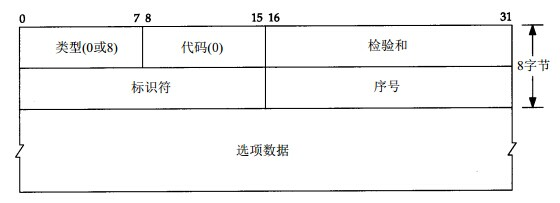

#ICMP回显请求和应答报文

ICMP回显请求和回显应答报文的格式：

##Ping程序

Ping程序用于对网络可达性进行测试，Ping程序使用ICMP报文中的回显报文进行实现。同时，Ping程序还提供了检查IP记录路由和时间戳选项的功能。

在Ping程序的实现中，发送回显请求的ping程序称为客户端，而被ping的主机被称为服务器。大多是的TCP/IP实现都是在内核中直接支持Ping服务器。

在回显请求中，客户发送的选项数据必须回显。在Unix系统中，实现的Ping程序吧ICMP报文中的标识字段设置为发送进程的进程号，这样，即使是在同一台主机上运行多个Ping程序，也可以对回显的报文进行识别。

序号字段是从0开始编号的，没法送一次新的回显请求，序号字段自动加1。ping程序打印出每个分组的序号字段，这运行用户可以查看是否有分组丢失，失序或重复。
