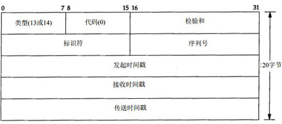

#ICMP时间戳请求和应答

ICMP时间戳请求报文允许一个系统向另一个系统查询当前的时间，返回的值是从午夜开始计算的毫秒数，协调的统一时间（Coordinated Universal Time，UTC）。这种ICMP报文的好处是它提供了毫秒级的分辨率，而利用其它从别的主机获取时间的方式只能提供秒级的分辨率。但是由于获取的时间是从午夜开始计时的，这个时间不包括日期信息，所以为了计算完整的时间，需要通过其它方式获得日期。

ICMP时间戳报文的格式：

发起请求的一端填写发起的时间戳，然后发送报文，应答的一端收到请求的报文时，填写接收时间戳，在获得时间后发送应答的时候，填写发送时间戳。在大多数实现上，接收时间戳和发送时间戳被设置为同样的值。

ICMP时间戳报文中包含了三个时间戳：发起时间戳，接收时间戳和发送时间戳，通过这些时间戳，还可以计算RTT的值：收到应答的时间 - 发送请求时间戳。
