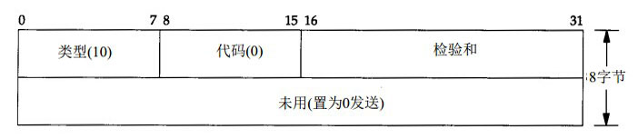
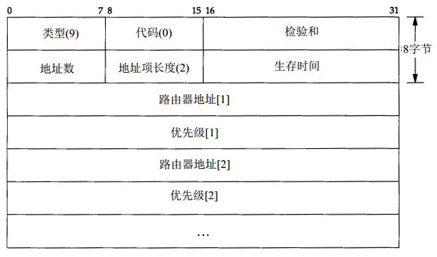

#ICMP路由器发现报文
ICMP的路由器发现报文有两种报文格式。

ICMP路由器请求报文的格式

ICMP路由器通告报文的格式

路由器可以在一份报文中通告多个地址。

* 地址数字段指明了报文中所含的地址数。
* 地址项长度字段指明了每对路由器地址项32-bits字的数目（地址项由路由器地址和优先级组成），该字段始终为2。
* 生存时间字段指明了通告地址的有效时间

通告报文的数据部分是由一对或多对IP地址和优先级组成的地址项组成。IP地址必须是发送路由器的某个地址。优先级是一个有符号的32-bits整数，指出该IP地址作为默认路由器地址的优先级，这里的优先级是与子网上的其他路由器相比较而言的。**优先级的值越大，那么优先级就越高。**优先级为0x80000000说明对应的地址不能作为默认路由器地址使用。优先级的默认值一般为0。

##ICMP路由发现报文在路由器和主机上的操作

###在路由器上的操作
当路由器启动以后，它定期在所有广播或多播接口上发送通告报文。准确的说，这些报文不是定时发送的，而是随机发送的，这样做事为了减少与子网上其他路由器发生冲突的概率。一般两次通告的时间间隔为450s和600s之间。而一份通过报文的默认生命周期为30分钟。

如果一个路由器的某一个接口需要关闭，那么该路由器可以在需要关闭的接口上广播或多播最后一份通告报文，并把报文的生存时间设置为0。

除了定期发送通告报文，路由器还要接受来自网络上其他主机发送的请求报文，并对这些报文进行响应。

如果网络上有多台路由器，那么可以为这些路由器设置不同的优先级。

###在主机上的操作
主机在引导启动期间，一般会发送三份路由器请求报文，每3分钟发送一次，一旦接收到一个有效通告报文，就停止进行发送请求报文。

主机除了进行发送请求报文来获得通告外，还需要监听来自路由器的通告报文，这些报文可以改变主机的默认路由器。另外，如果没有接收到来自默认路由器的通告报文，那么默认路由器会超时。

如果网络中有路由器，那么路由器就会每隔10分钟发送通告报文，报文的生命周期是30分钟，这说明如果主机即使错过了一两次的通告报文，主机的默认路由表项也是不会超时的。
