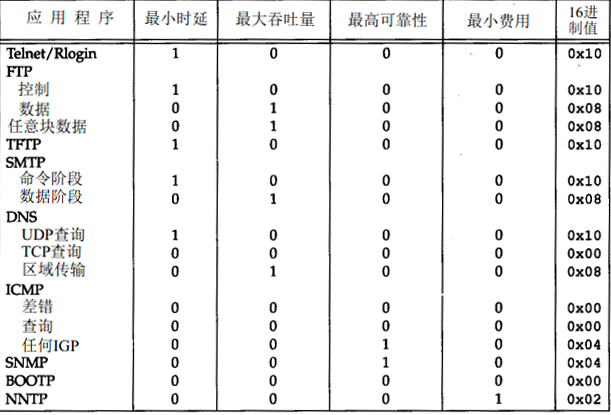
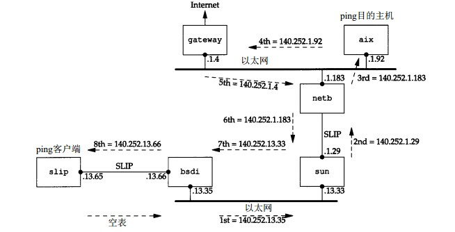
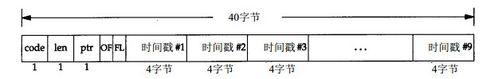

# IP 协议

## 简介

IP协议，即（Internet Protocol）。IP协议是TCP/IP协议栈中最重要的协议之一，TCP和UDP协议都是在IP协议的基础上进行工作的。

IP协议处在TCP/IP协议模型的 **网络层** 。IP协议是一个提供不可靠，无连接的数据包传输服务的协议。

它的不可靠性体现在：IP协议不能保证每一个IP数据报都成功地被对端接收，IP协议只是负责传输交给它的数据包，而且它也确实将数据报传输出去了，但是，如果在传输线路上出现问题，IP不能对这种情况进行处理。对于传输过程的可靠性，需要上层协议来保证，比如TCP协议。

它的无连接性体现在：IP数据包对于发送的数据报是独立处理的，不关心数据报的状态。所以在发送数据报的时候，IP协议可以以无序的方式发送和接收数据报。

## IP层的工作流程

## IP协议的 Head 结构

### 版本（4）
**4 bits**的版本号表示当前协议使用的版本，一般对于IPv4来说，版本号为4。	    

### 首部长度（4）
**4 bits**的首部长度字段，表示首部所占的32-bit的个数（**包括选项部分**）。由于该字段只有4个字节的空间，所以，一个首部的长度最大限制为 `(2 ^ 4 - 1) * 4 bytes = 60 bytes`，而一般情况下，普通IP数据报中该字段的值为 **5** ，所以，首部长度为20 bytes。

### 服务类型（8）
在服务类型(TOS)字段中，包含了**3 bits**的优先权子字段（现在不用了），**4 bits**的TOS子字段和**1 bit**的未使用位（置为0）。

4 bits的TOS字段分别表示：   

*   最小时延
*   最大吞吐量
*   最高可靠性
*   最小费用

TOS字段中的4位，两两之间是互斥的，每次只能置其中的一位为1。如果每一位都是0，则表示是一般的服务。

不同应用的TOS建议值：

###总长度字段（16）
总长度字段表示整个IP数据报的长度，以字节为单位。通过IP协议的首部长度字段的值和总长度字段的值，我们可以得出IP数据报中数据部分的起始位置和长度。

该字段占了**16 bits** ，所以一个IP数据报最大可以达到`2 ^ 16 - 1 = 65535 bytes`的长度。但是，主机也规定，不能接受超过576字节的数据报。这个限制不是都遵守的，按照实现而定 *如果一个数据报被分片，那么这个字段的值也会随着变化。*

###标识字段（16）
标识字段唯一的标识出主机发送的每一份数据报。通常每发送一份数据报，该字段的值就会累加1。

*该字段在分片的情况下，会被复制到每一个分片中*

###标志字段（3）
标志字段占3 bits，用于和**标识字段**和**片偏移字段**配合使用，用于分片。该标志字段中，第一位一般不适用，作为预留。而第二位称为**DF**位（即不分片位）：`DF = 1`表示不对数据报进行分片。第三位称为**MF**位，表示对于被分片的数据报的每个分片，除了最后一个分片外，其余分片的`MF = 1`，而最后一个分片的`MF = 0`。

###片偏移字段（13）
片偏移字段长度为13 bits，表示分组数据起始点相对于数据报头部的偏移位置，这么处理，可以方便目的方按照分片的顺序重新组织报文。（*因为IP协议是一个无连接的协议，数据报的顺序我们无法保证*）

###TTL字段（8）
TTL生存字段（Time-To-Live）设置了数据报可以经过的最多的路由器数。它指定了数据报的生存时间。TTL字段的初始化值由源主机设置，一旦设置了该值，在每一次经过路由器的时候，该字段的值减1，当某个数据报的TTL字段为0的时候，数据报被丢弃，并发送一个ICMP报文通知源主机。

###协议字段（8）
协议字段用于标示出数据报数据段中包含的是使用哪种协议的数据报，这有助于IP层向上层递交接收到的数据报。协议字段通常包含了传输层和网络层的协议的十六进制类型值，如：TCP、UDP、ICMP等。	

*   UDP = 0x11
*   TCP = 0x06
*   ICMP = 0x01

###首部检验和字段（16）
首部检验和字段保存了根据IP首部计算的检验和。该字段的检验和只计算了数据报首部的时候，不包括数据报的数据部分。（*在ICMP、UDP、TCP这些协议中，包含了覆盖数据部分和首部的检验和*）。

*计算一份数据报的检验和的过程如下：*

1.  *首先把检验和字段设置为 0。*
2.  *然后，对首部中的每一个16-bits进行二进制反码求和（将整个首部看成是一串16 bits的字组成），并将结果保存在检验和字段中。*

*ICMP、IGMP、TCP、UDP都使用和IP数据报一样的计算方法计算检验和字段。*

###源IP地址和目的IP地址字段
每一份数据报都包含了源IP地址和目的IP地址，这两个字段都占了32-bits。

###选项字段
选项字段是IP数据报中可以变长的字段，包含了一些可选的信息：

* [安全和处理机制][1]
* [记录路由][2]
* [时间戳][3]
* [宽松路由选站][4]
* [严格路由选站][5]

选项字段一直都是以32-bits作为边界的，在必要的时候，需要填充0作为填充字节。这样是为保证数据报首部始终是32-bits对齐的。

##IP 分片
数据链路层在发送数据报的时候需要限制发送数据报的最大长度。任何时候IP层接收一份要发送的数据报的时候，需要判断该使用本地的哪个接口发送该数据报，并且需要查看该接口网络的MTU。IP把MTU的值和IP数据报的值进行比较，如果一个IP数据报无法放入一个MTU大小（典型的以太网，MTU的大小为1500字节）的物理帧中，则需要进行分片处理。

分片操作可以发生在源主机上，也可以发生在一个中间路由器上。

如果把一份数据报进行了分片，那么对于每一个分片，只有在分片到达了目的主机以后，才可以进行组装。组装操作由目的主机的IP层进行，这么做是为了使得对于传输层而言，这种行为是透明的。一个分片在必要的时候还可以被再次被分片。

由于每个分片都是独立被中间路由转发的，所以每个分片都有一个IP首部。而且每个IP首部都包含了提供分片和重组的必要的信息。（包括IP首部中的标志字段，标志字段已及偏移字段）

IP标志字段中，包含了一个DF位，表示不分片位。该位如果被指定了`DF = 1`，则表示不进行分片。如果在传输过程中必须进行分片，则将该数据报丢弃，然后发送一个ICMP报文给源主机（这可以用于探测路径MTU的大小）。

尽管IP数据报的分片操作对于传输层而言是透明的，但是，如果一个IP数据报的某一个分片丢失，那么就得重传整个数据报。因为IP层没有和TCP一样的超时和重传机制，而这些只能通过更加高层的协议，如TCP协议来进行保证。

###ICMP不可达差错（需要分片）
ICMP不可达差错发生的其中一种情况是，IP层需要对数据报进行分片，但是IP数据报首部中设置了`DF = 1`的不可分片位。这个时候，中间路由器就会丢弃该数据报，并向源主机发送一份ICMP报文。

具体的报文格式可以查看这里：[ICMP不可达差错（需要分片）][6]

##IP路由选择

在普通情况下，IP可以从TCP、UDP、ICMP和IGMP接收数据报（即在本地生成的数据报）并进行发送，或者从一个网络接口接收数据报并进行转发。IP层在内存中有一个路由表，当收到一份数据报并进行发送的时候，它都要对该表搜索一次。当数据报来自某个网络接口时，IP层首先检查该数据报的目的地址是不是本地的IP地址之一或者IP广播地址。

* 如果是其中之一，那么数据报就被发送到该数据报IP首部协议字段指定的协议模块中进行处理。
* 如果不是其中任何一个地址，那么，
    * 如果IP层被配置为路由器功能，那么就对数据报进行转发
    * 否则，数据报被丢弃

路由表中的每一项都包含了如下的信息：

* 目的IP地址，目的地址既可以是一个主机地址，也可以是一个网络地址，通过标志字段来指定
* 下一跳路由器的IP地址，或者是直接相连的网络的IP地址
* 标志
* 数据报转发的外出接口

IP选路的具体描述在这里[IP选路][7]

##IP选项

###IP记录路由选项

Ping程序提供了查看IP记录路由选项的机会。如果通过选项设置ping程序，开启了ping程序的记录路由功能，那么ping程序在发送出去的IP数据报中设置了IP经过的路由信息（这个IP数据报中包含了ICMP回显报文）。这样，每个经过的路由器就会将它的IP地址放到这个选项字段中，当数据报到达目的主机的时候，记录的IP列表就会复杂到ICMP的回显报文中，并且在返回途中，也把经过的路由器的地址放到清单中，当ping程序收到回显应答时，就可以获得这份完整的IP路由清单了。

为了实现这个功能，需要中间路由器也支持记录路由的功能。

为了存放IP地址，需要存储这些地址的空间，但是IP首部的空间是有限的（通过首部长度字段确定），由于IP首部长度最小为20字节，记录路由选项占据了3个字节，这样就只剩下37个字节来存放IP地址清单，那么最多只能存储9个IP地址（每个IP地址占据4个字节）。

IP数据报中的记录路由选项的格式：

* code字段，占据1个字节，指明IP选项的类型，对于记录路由选项来说，这个值被设置为7。
* len字段，最大总长度字段，占据1个字节，表示记录路由选项的总长度，最大为39。
* ptr字段，占据1个字节，称为指针字段，这个字段是一个从选项的第一个字节开始计算的指针，指向下一个IP地址可以存放的位置，它的最小值是4，指向存放第一个IP地址的位置，后面依次是每个IP地址（类似于一个指向队头的指针）。当填满了9个报文段以后，ptr的值为40，指向最后一个ip地址的下一个字节处。
在路由器中，处理记录路由选项的时候，应该考虑记录那个IP地址（是入口IP地址还是出口IP地址），在RFC 791中指出了，记录路由中记录的是出口IP地址，并且，当源主机收到回显应答的时候，需要将入口IP地址填入清单中。

###IP时间戳选项

IP时间戳选项和记录路由选项类似，IP时间戳选项的格式如下：

* code字段，对于时间戳选项而言，这个值为0x44。
* 其他两个字段和上面的记录路由选项格式用法一样，选项的总长度字段一般为36或40。
* OF字段，表示溢出字段
* FL字段，表示标志字段，时间戳选项的操作通过标志字段来控制	    
    	

如果路由器由于没有空间填写时间戳选项，那么路由器就要增加OF字段的值。

时间戳选项的取值一般为UTC午夜开始计算的毫秒数，和ICMP时间戳请求和应答类似。如果路由器不支持这种格式的时间，那么可以插入路由器使用的时间格式，但是必须打开时间戳中的高位来表示使用的不是标准的值。

[6]: file://C:\Users\RuFeng\Desktop\ICMP协议\ICMP不可达报文.html "ICMP不可达报文"
[7]: file://C:\Users\RuFeng\Desktop\IP协议\IP选路.html "IP选路"
