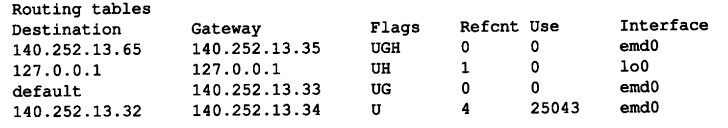
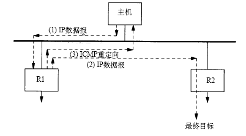

#IP 选路

##IP 选路的原理

IP路由选择的执行方式：

1. 搜索路由表，寻找能与目的IP地址完全匹配的表项（网络号和主机号都匹配）。如果找到了，那么根据标志字段，如果标志字段表示的下一跳是一个路由器地址，那么就将该报文发送到下一跳路由器上，如果标志字段表示下一跳是一个直接相连的网络设备接口，那么，就将报文发送到这个直接相连的接口上。	
2. 搜索路由表，寻找能与目的网络号匹配的表项，如果能找到，则把报文发送给该表项指定的下一跳路由器或者直接相连的设备接口上（取决于标志字段指定的类型，下一跳是路由器还是直接相连的设备）。	
3. 搜索路由表，寻找默认路由表项，如果可以找到，则把报文发送给该表目指定的下一个路由器。

如果上述的步骤执行完后，都不成功，那么该数据包就不能被转发。

##简单路由表

查看主机的路由表，可以使用netstat命令来查看：

`netstat -rn`

其中，`-r`选项表示输出路由表，`-n`选项表示以数字的格式进行输出。

下面是摘自《TCP/IP协议详解第一卷》上的截图：

对于一个给定的路由表，在其标志字段，可以有如下这些标志：

* U 表示该路由表项可以使用
* G 表示该路由表项指向的下一站是一个路由器。如果没有指定该标志，那么下一站就是目的地
* H 表示通过该路由表项**最终**可以到达一个主机，目的地址是一个完整的主机地址。如果没有这个标志，那么说明目的地址是一个网络地址：一个网络号或者是一个网络号和子网号的组合。
* D 该路由是由重定向报文创建的
* M 该路由是由重定向报文修改的

其中，G标志区分了一个路由是一个直接路由还是一个间接路由，对于直接路由来说，是没有G标志的。直接路由和间接路由的区别是，当发送一个数据包到下一站的时候，如果路由表给出的是一个直接路由，那么下一站就是目的地，那么在数据包中的链路层地址就是目的站的链路层地址。但是如果路由表给出的是一个间接路由，那么下一站的是一个通往目的地的其中一个路由器，那么在数据包中的链路层地址就是下一个路由器的链路层地址，而不是一个目的地主机的链路层地址。

G标志和H标志是有区别的，G标志区分了该路由是一个直接路由还是一个间接路由。而H标志表明，目的地址是一个完整的主机地址，如果没有H标志，那么说明目的地址是一个网络地址。当在搜索路由表的时候，主机地址项在进行匹配的时候，必须和数据包中的目的地址完全匹配。而如果是网络地址项，那么只需要匹配网络部分的地址就可以了。

##没有目的地的路由
如果对路由表的搜索，没有找到搜索匹配的项，也没有默认项。那么，地数据报的处理，取决于该数据报是由主机产生的还是由该主机进行转发的。如果数据报是由主机产生的，那么就给发送该数据报的应用程序返回一个差错，或者是“主机不可达差错”或者是“网络不可达差错”。如果是被转发的数据报，那么就给发送端发送一份ICMP主机不可达的差错报文。

当路由器接收到一份IP数据报但不能转发时，就要发送一份ICMP“主机不可达”差错报文。ICMP“主机不可达”差错报文的格式在这里[ICMP不可达差错报文][1]

##ICMP重定向差错
当IP数据报被发送到另一个路由器时，收到数据报的路由器就要发送ICMP重定向差错报文给IP数据报的发送端。只有在主机可以进行路由选择的情况下，我们才可能看到ICMP重定向报文（因为如果不能进行路由选择，那么就只有一个路由，就没有选择的余地了，也就没有重定向的必要了）。

一个ICMP重定向的例子：

1. 假定主机发送一份IP数据报给R1（假定R1是该网络上的默认主机）
2. R1收到数据报并检查它自己的路由表，如果发现R2是发往目的地的下一站路由，那么它将把数据报发送给R2，但当他发送的时候发现发送的接口和接收数据报的接口是相同的（也就是说刚才发送过来数据报的主机和R2在同一个网络中）。
3. 然后R1就会给主机发送一份ICMP重定向差错报文，告诉主机R2才是正确的下一站路由。

**重定向**一般用来让就少数选路信息的主机逐渐建立更加完善的路由表。这样，主机在启动的时候路由表可以只有一个默认表项，一旦默认路由发生差错，默认路由器将通知它进行重定向，并允许主机对路由器表进行更改。ICMP重定向机制可以允许TCP/IP主机在进行选路的时候不具有智能特性，而是把这些智能机制放到路由器上。

ICMP重定向报文的格式[ICMP重定向报文的格式][2]

对于ICMP重定向报文，需要遵循以下规则：

* 首先，重定向报文只能由路由器生成，不能由主机生成
* 其次，重定向报文是为主机而不是为路由器使用的。

产生ICMP重定向报文需要满足如下的条件：

1. ICMP重定向报文的出接口必须等于造成产生该ICMP重定向报文的IP数据报的入接口
2. 用于向外传送数据报的路由不能被ICMP重定向报文创建或修改过，而且不能是路由器的默认路由。
3. 数据报不能用源站选路来进行转发。
4. 内核必须配置成可以发送重定向报文。

当一台主机收到重定向报文后，在修改路由表之前，需要进行如下的检查，防止路由表被恶意修改：

1. 重定向报文中指定的新的路由器必须是与主机直接相连的
2. 重定向报文必须来自当前到目的地所选择的的路由器
3. 重定向报文不能让主机本身作为路由器
4. 被修改的路由必须是一个间接路由

关于重定向，路由器应该发送的只是对主机的重定向（使用类型代码1或3），而不是对网络的重定向。子网的存在，使得难于准确的指明何时应该发送对网络的重定向而不是对主机的重定向。

##ICMP路由器发现报文

初始化主机路由表的一种方法是使用配置文件来配置静态路由，使用这种方法一般可以用于配置默认路由，然后使用ICMP重定向报文来完善主机的路由表。另一种方法是使用ICMP路由器通告和请报文。

一般情况下，当主机启动的时候，会广播或多播一份路由器请求报文。然后当前网络中的路由器会处理这样的请求，然后返回一份路由器通告报文。另外，路由器会定期的广播或多播它们的路由器通告报文，允许每个正在监听的主机相应的更新它们的路由表。

ICMP路由器发现报文的格式如下[ICMP路由器发现报文的格式][3]

**最后需要注意的是**：ICMP重定向和ICMP路由器发现机制都是针对主机和路由器之间的通信，而不是路由器之间的通信，路由器之间的通信是使用动态选路协议来进行的。

[1]:file:///C:/Users/RuFeng/Desktop/ICMP协议/ICMP不可达报文.html "ICMP不可达报文"
[2]:file:///C:/Users/RuFeng/Desktop/ICMP协议/ICMP重定向报文.html "ICMP重定向报文"
[3]:file:///C:/Users/RuFeng/Desktop/ICMP协议/ICMP路由发现.html "ICMP路由发现"

