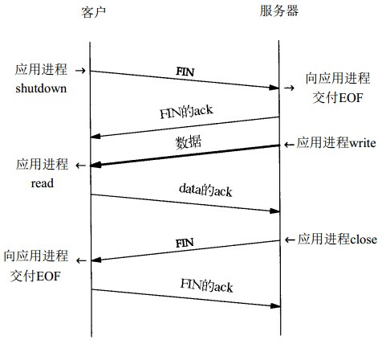
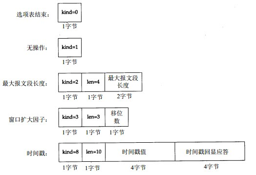

#TCP协议

##简介

TCP协议是传输层协议的一种，另一种传输层协议是UDP。TCP协议使用网络层的IP协议进行通信，但是IP协议是一个不可靠的，不是面向连接的协议。但是TCP协议虽然工作在一个不可靠的，不是面向连接的协议之上，但是却通过确认机制，实现了面向连接的可靠的字节流服务。

TCP的面向连接意味着两个使用TCP的应用程序在彼此交换信息之间，需要先在两个主机之间建立一个TCP连接。

TCP的可靠性是通过下面的方式提供的：

* 应用程序的数据被分割成合适的大小来被TCP进行发送。通过TCP传递给IP的信息单位称为报文段或段
* 当TCP发出一个数据段后，TCP的发送端会启动一个定时器，如果在这个定时器超时之前，应用程序不能收到这个报文段的应答，那么将重发这个报文段。
* 当TCP的一端收到了一份数据段，那么TCP将会发送一份对这份报文段的确认给对端。这个确认一般不是立即发送的，可能会延迟几分之一秒（这称为经受时延的确认）。
* TCP会对其首部和数据部分计算检验和，这个检验和是一个端到端的检验和，用于确认数据在传输过程中没有被损坏，如果收到的报文段的检验和出错，那么TCP将丢弃这个报文段，也不会对这个报文段进行确认（等待对方进行重传）。
* 由于TCP是使用IP协议来进行传输的，而IP协议不是一个面向连接的协议，所以在数据被传输到对端的时候可能是失序的，在这种情况下，TCP可以对收到的数据段进行重新排序，然后将重新排序后的数据段递交给应用程序。
* 由于IP数据报是不可靠的，可能会出现数据段重复的情况，而TCP可以丢弃重复的数据段。
* TCP提供了流量控制，TCP连接的每一方都有固定大小的缓冲区空间。TCP的接收端只能允许对端发送缓冲区可以放得下的数据。这可以防止较快的主机是的较慢的主机的缓冲区溢出。

TCP提供的是字节流的服务，也就是说TCP不在字节流中插入记录标识符。如果一个应用程序分3次发送了10字节，20字节，30字节的数据，那么在接收端可以分两次接收30字节的数据。

TCP对字节流的内容不作解释。TCP不关系传输的数据是二进制数据还是字符数据，它把对数据内容的解释交给了应用层协议。

##TCP首部
TCP数据报封装在IP数据报中：

TCP首部格式：

* 在每个TCP报文段中，都包含了源端口和目的端口号，端口号用标识发送端和接收端的应用进程。这两个端口号和IP数据报中的两个IP地址对应了两对地址对：（源IP地址，源端口号）和（目的IP地址，目的端口号），这两对地址对唯一确定了一个TCP连接。
* 序号字段，该字段用于标识出从TCP发送端到TCP接收端发送的数据字节流，它表示在这个报文段中的第一个数据字节。TCP使用序号对每个字节进行计数。序号是32-bit的无符号数，序号到达`2^32 - 1`后又从0开始。
当建立一个新的连接时，标志字段中的SYN标志变为1。序号字段包含了由当前主机选择的该连接的初始序列号ISN（Initial Sequence Number）。该主机要发送数据的第一个字节序号为这个ISN加1。因为SYN标志消耗了一个序号（同样的，除了建立连接的时候需要消耗一个序号，在发送FIN分节的进行关闭的时候也要消耗一个序号）。
* 确认序号字段，由于每个传输的字节都被计数，所以确认序号字段的值是发送确认的一端期望收到的下一个序号。只有在标志字段中的ACK标志被置为1的时候，确认字段才有效。
TCP为应用层提供了全双工的服务。这意味着数据能在两个方向上独立的进行传输，因此，连接的每一端必须保持每个方向上的传输数据序号。
* 首部长度字段，该字段给出了首部中32-bits字的个数。需要这个字段是因为TCP首部中的选项字段是可变的。这个字段占据4-bits，因此TCP首部的长度最多有60个字节。如果没有选项字段，那么一个TCP首部的正常长度为20个字节。
* 标志字段，TCP首部中的标志字段占据6-bits，这些标志不是互斥的，可以有多位被同时置为1。
    这些标志的含义如下：
    * URG 紧急指针有效
    * ACK 确认序号有效
    * PSH 接收方应该尽快将这个报文段交给应用层
    * RST 重建连接
    * SYN 同步序号用来发起一个连接
    * FIN 发送端完成发送任务
* 窗口大小字段，TCP的流量控制通过连接的每一端通过声明的窗口大小来提供。窗口大小为字节数，起始于确认序号字段指明的值，这个值是接收端期望接收的数据的大小。窗口大小字段占据16-bits，窗口大小最大为65535个字节。
* 检验和字段，这个字段的检验和覆盖了TCP数据报的首部和数据部分，这是一个强制性的手段，一定是有发送端计算并储存，然后由接收端进行验证。TCP检验和的计算方法和UDP类似，都使用了一个伪首部。
* 紧急指针字段，该字段只有在标志字段URG标志被置为1的时候才会有效。紧急指针字段的值是一个正的偏移量，和序号字段中的值相加表示紧急数据最后一个字节的序号。TCP紧急方式是发送端向接收端发送紧急数据的一种方式。
* 可选字段，可选字段中，最常见的是**最长报文长度字段，即MSS字段（Max Segment Size）**，每个连接方通常都在SYN报文段中指明这个选项。它指明本端所能接收的最大长度的报文段。

##TCP连接的建立和终止

TCP是一个面向连接的协议，无论哪一方向另一方发送数据，都必须先在两方之间建立一个连接。

###建立一个连接的过程（三路握手）

建立一个TCP连接需要进行在两个主机间进行3次通信：

1. 请求端发送一个SYN报文段给服务器端，在SYN报文段中包含了一个初始序列号（ISN）。在这个报文段中还包含了一个MSS，用于通告对端可以发送的最大报文段的大小。
2. 服务器端对客户发送过来的SYN进行确认，并且发送一个SYN给客户。服务端发送的ACK的序列号是客户发送过来的SYN中的ISN的值加1。
3. 客户在收到服务器端发送过来的SYN后，对其进行确认。

这样，一个3路握手就完成了一个TCP连接。

建立一个TCP连接的过程：

发送第一个个SYN的一端将执行主动打开。接收这个SYN的一端将进行被动打开。

当发送SYN进行建立连接的时候，TCP会为连接选择一个初始序列号。ISN的值是随时间而变化的，因此每一个连接都会有不懂的ISN。在RFC 793中，一个ISN是一个32-bits的计数器，每过4ms增加1。这样做是为了防止在网络中被延迟的分组在以后又被传送，造成对连接数据的错误处理。

####TCP连接的同时打开

当两个应用程序同时彼此执行主动打开的情况下，每一方都会发送一个SYN，并且这些SYN必须传递给对方。在这种情况下，每一端都要绑定一个地址和端口，使得双方都可以将SYN发送给对端。这种情况称为**同时打开**。

TCP特意设计成可以处理同时打开，对于同时打开的情况下，它仅建立了一条连接而不是两条连接。

当出现同时打开的时候，状态变迁图如下：

两端几乎同时发送SYN，并都进入**SYN_SENT**状态，当每一端收到SYN的时候，状态都变为**SYN_RCVD**，同时，它们再发送对刚才SYN的确认和自己的SYN报文段。当双方接收到第一个SYN报文段的的ACK的时候，状态就变为**ESTABLISHED**。

一次同时打开一共交换了4个报文段，比正常的TCP连接建立过程多了一个报文段，并且，两端不是服务器和客户端的关系，因为每一端既是客户端也是服务端。

###终止一个TCP连接
建立一个TCP连接需要进行三次握手，然后，终止一个TCP连接，则需要进行四次握手。这是由于TCP的半关闭造成的。TCP连接是一个全双工的连接，在两个方向上都可以独立的传输数据，所以如果需要完全的关闭一个连接，则需要对每个方向都要进行关闭。

TCP执行关闭的时候，当一端已经完成了对数据的发送任务，那么这一端可以发送一个FIN报文段来终止这个方向上的连接。当一端收到了一个FIN以后，另一端必须发送一个对这个FIN报文段的ACK。然后必须将这个FIN分节报告给应用程序。造成发送FIN数据段一般是应用层进行关闭的结果。

当一个TCP的连接的一端收到一个FIN的时候表示连接的读方向上已经被关闭了（接收操作，也就是读操作），但是由于TCP连接是全双工的，所以接收到一个FIN数据段，只是表明关闭了读端，但是写端还是不受到影响的，该连接在写方向上还是可以继续写数据的。这种方式的关闭称为半关闭。

在进行关闭的时候，首先进行关闭的一方称为执行主动关闭，而另一方将执行被动关闭。但是，如果双方都执行主动关闭，也是可行的。这称为同时关闭。

TCP执行关闭的过程：

####TCP半关闭
TCP提供了连接的一端在结束它的发送后还能接受来自另一端的数据的能力。这称为**半关闭**。

在一个TCP连接中，一端已经完成了发送数据的任务，它可以发送一个FIN报文段给对端，然后对端发回一个对这个报文段的ACK，这是，该TCP连接的一个方向上的连接就被关闭了，发起主动关闭的一端现在将不能再发送数据，但是可以接受来自对端的数据，直到对端发送一个FIN报文段，这样才完成了对这个TCP连接的完整的关闭。

TCP半关闭的：

####同时关闭

如果是一端发起的关闭请求，则称为这端执行主动关闭。如果双方都执行主动关闭，这也是可以的。TCP允许同时关闭。

当应用层发出关闭命令的时候，两端通过发送第一个FIN报文段，两端都从**ESTABLISHED**状态变为**FIN_WAIT1**状态，然后双方在接收到对端发送过来的FIN报文段以后，状态从**FIN_WAIT1**转变为**CLOSING**状态，然后两端都发送ACK对接收到的FIN报文段进行确认，然后双发在接收到对端发送的ACK报文以后，状态变为**TIME_WAIT**状态。

状态变化情况如下：

同时关闭发送的报文段的数据和正常的有序关闭发送的报文段的数目是一样的。

###TCP连接中的最大报文段大小（MSS）
最大报文段大小（MSS）表示TCP传送到另一端的最大数据块的长度（不包括TCP和IP首部，只是数据部分），当一个连接建立时，连接的双方都要通告各自的MSS。

在建立一个连接时，每一方都有用于通告它期望接收的MSS的选项（MSS选项只能出现在SYN报文段中）。如果一方不接收来自另一端的MSS值，则MSS就被定义为536字节（这样，加上20字节的TCP和20字节的IP首部，就变成576字节的IP数据报了，因为在IP数据报中，虽然其16-bits的报文报文总长度字段给出了IP数据报最大为65536字节的大小，但是主机规定了不能接受大小超过576字节大小的数据报）。

一般来说，如果没有分段发生，MSS的值越大越好。报文段越大，网络的利用率就越高。当一个TCP发起一个连接的时候，其SYN报文段中的MSS字段的值被设置为该主机出口路径上的MTU大小减去固定IP首部和TCP首部的长度的值。对于以太网来说，由于以太网的MTU值为1500字节，减去IP和TCP首部共40字节，那么MSS的值就别设置为1460字节。

###TCP状态转移图

状态图中对应的TCP建立和终止状态

####TIME_WAIT（2MSL等待状态）

TIME_WAIT状态也称为2MSL等待状态，每个TCP实现都会选择一个报文段最大生存时间MSL（Maximum Segment Lifetime），这个时间是一个数据包在网络中被丢弃前的最长生存时间。

当一个TCP连接的一端执行主动关闭的时候，在发送最后一个ACK以后，该TCP连接将进入TIME_WAIT状态，并且停留在改状态的时间是2倍的MSL。将执行主动关闭的一端停留在TIME_WAIT状态是有原因的：

1. 可以可靠的结束一个TCP连接
    因为当一个TCP执行关闭的时候，在发起主动关闭的一端，在接收到对端的一个FIN报文段后，会向对端发送一个ACK进行确认。如果在发送的ACK丢失的情况下，对端可能会重传一个FIN报文段，这个时候如果主动关闭的一端没有停留在TIME_WAIT状态，那么就会对重传FIN的那一端发送一个RST（因为对端没有应用程序在该连接上），这将使对端错误的以为是连接出错了。所以，将主动关闭的一端停留在TIME_WAIT状态，可以在最后一个ACK丢失的情况下进行重传。	    
2. 允许该连接的以前的分组可以再网络中消逝
    因为，如果在一个连接终止后，如果最后没有TIME_WAIT状态，那么当我们马上建立在同一个IP和同一个端口上的连接的时候，如果网络存在上一个连接的数据报，那么这些数据就会被错误的以为是这个连接的数据（实际是前一个连接的数据），这会造成错误。为了避免这种情况的发生，TCP阻止在TIME_WAIT状态期间发起这样的新连接，而把TIME_WAIT状态的时间定为2MSL，是因为让任何一个方向上的数据报可以在MSL时间内在网络上被丢弃。

一般情况下，都是客户端先发起主动关闭的，这意味着服务器端是不会进入TIME_WAIT状态的，而对于客户端而言，因为每次重新开启客户端都是不绑定IP地址和端口的，所以即使存在TIME_WAIT的连接，客户端也一般不会重用处于这个状态的连接。

虽然默认情况下，处于2MSL状态的连接是不能重新建立一个连接的，但是在套接字中，可以指定SO_REUSEADDR选项来开启对处于这个状态的连接进行重用。

###复位报文段（RST）

当在连接上出现错误的时候，TCP将会发出一个复位报文段。

导致发送RST报文段的情况：

1. 到达一个不存在的端口的连接请求   
    产生复位的一种情况是当连接的请求到达时，目的端口没有进程在监听。对于UDP协议而言，当一个数据报到达一个没有在监听的端口时，将产生一个ICMP端口不可达的信息，而对于TCP，将产生一个复位RST报文。

2. 异常终止一个连接		
    在正常情况下终止一个连接，可以使用发送FIN分节来进行，由于是在所有数据都发送完毕以后才进行关闭，所以这称为有序释放。但是，如果使用RST来释放一个连接，则由于是异常终止一个连接，不进行TCP的正常关闭，所以会出现数据丢失。
    使用异常终止有两个优点：
	1. 丢弃任何待发送的数据报并立即发送一个RST报文段
	2. RST的接收方会区分另一端执行的是正常关闭还是异常关闭，应用程序需要使用API提供产生异常关闭而不是正常关闭的手段。
    产生RST来终止一个连接，可以使用套接字的SO_LINGER选项来实现，关于SO_LINGER选项，可以查看这里[SO_LINGER选项][1]

需要注意的是，接收到RST的一端不会对这个RST报文段进行任何响应，接收到这个RST的这一段将终止该连接，并通知应用层连接被复位。

####检测半打开连接
如果连接的一端已经断开连接，但是另一端还不知道，那么称这样的连接时半打开的。任何一端的主机出现异常，都可能会导致半打开的情况发生。

对一个半打开的连接上发送一个数据报，对端将发送一个RST复位报文段，如果服务器端重启，那由于服务器端不知道这个连接的信息，所以会发送一个RST报文段来异常终止一个连接，如果服务器端没有服务在监听，那么将发送一个RST，表示请求的端口不存在。同样的，客户端如果出现异常，也会出现上述的情况。

###TCP选项

TCP首部可以包含选项部分，在最初的TCP规范中定义的选项包括：选项表结束、无操作以及最大报文段长度，在RFC1323中，定义了新的TCP选项。

选项的格式如下：

每个选项的开始都是一个字节的kind字段，这个字段用于说明选项的类型。kind字段为0或者1的选项只占用一个字节大小，而其他选项的kind字段后面还包括了len字段，用于指定该选项的总长度，覆盖kind字段和len字段。

需要无操作选项是为了允许发送方填充字段为4个字节的倍数。如果通过tcpdump查看，则可以有如下的输出：

在上述输出中，MSS选项被设置为512，后面是nop，表示无操作，接着是一个窗口扩大选项。其中第一个nop无操作选项是为了将窗口扩大选项填充为4字节对齐，同样的后面的10字节时间戳选项放了两个无操作选项，使得占据12个字节，这样也使得4字节对齐。

##TCP的交互数据流

在TCP传输的数据中，包括了两类数据：成块的数据和交互数据。承载成块的数据的报文一般都是满长度的，充分利用了网络的带宽。而相对于成块数据，交互数据一般是一些小数据，用户进程间的交互。

如下是一个交互数据流的例子：（来自TCP/IP协议详解第一卷P.201）

观察一个Rlogin程序上的交互命令产生的数据流。在使用rlogin程序进行交互时，每一次按键都会产生一个数据分组。每次从客户到服务器的数据都是一个字节按键，而不是一行文本。而且远程服务器会回显用户发送过去的数据。

这样会产生4个报文段：(1)来自客户的交互数据，(2)来自服务器端的回显数据，(3)来自服务器的按键确认，(4)来自客户的按键回显确认。

这4个报文段如下图所示：

一般情况下，第二个报文段一般会和第三个报文段进行合并，使得确认和回显一起发回给客户端。这种合并的算法称为**经受时延的确认**。

###经受时延的确认

下面的例子演示了从bsdi发送扫srv4的7个ACK被标记为经受时延的ACK。

观察后接收数据和发送ACK之间的时间差，会发现这些时间差（星号部分的括号中的数据，表示前一个时间点到当前这个时间点的差值）是随机的：123.5、65.5、109.0、42.0、140.3和195.8ms。通过这些数据，不能看出这些时间差之间的联系，但是，如果再看下我们每次发送ACK的时间点（使用星号*标出，分别为：139.9、539.3、940.1、1339.9、1739.9、1940.1和2140.1ms，这些数据之间的差值正好大约是200ms的整数倍。这是因为，TCP使用了200ms的定时器，TCP的200ms定时器使用了内核的200ms的固定超时时间。		    
由于需要进行确认的数据是随机时间到达的，所以，当一个需要确认的数据到达的时候，如果内核当前的200ms计时器还没超时，那么就需要等到当前的200ms计时器超时以后，才会发送这个数据的确认，而由于数据到达的时候可能是定时器重置以后的某一个时间点，这个时间点可能离200ms超时很近，也可能很远，所以就会出现上面的“数据到达时间和数据确认时间之间的时间差”随机出现的原因。

通常TCP在接收数据后不会立即发送对这些数据的确认，相反，TCP会延迟发送这些数据，这样做会使得ACK与需要沿该方向发送的数据一起发送（这种现象称为数据捎带ACK）。在大多数实现中，将这个延迟时间设置为**200ms**，也就是说，TCP将延迟200ms来发送数据的确认以等待是否有数据要一起发送给对端。而这样的确认就称为**经受时延的确认**。

###Nagle算法

nagle算法是用于避免在网络中发送小分组的数据，以避免在网络中出现增加拥塞的可能性。

nagle算法要求一个TCP连接上最多只能有一个未被确认的未完成小分组，在这个小分组的确认到达之前，发送端不能对网络发送其他小分组。相反，TCP在等待网络上小分组的这段时间内，收集发送端产生的小分组来组成一个相对更大的分组，然后在确认到达的时候将这个分组发送出去。

由于nagle算法是通过小分组的确认来决定什么时候才可以发送小分组。所以这个算法是自适应的：确认到达的越快，数据也就发送的越快。而在希望减少小分组数目的低速广域网上，则会发送更加少的小分组。

####关闭Nagle算法
在一些情况下，比如交互式操作中，需要系统发送信息的实时性，所以不能使用Nagle算法，所以，在这些情况下，需要关闭Nagle算法。

关闭Nagle算法，可以通过套接字选项的**TCP_NODELAY**来进行关闭。

##TCP的成块数据流

如下是一个网络中，svr4向bsdi发送8192个字节的数据的过程：

* 报文段1~3表示了一个TCP连接的建立过程。
报文段4~6表示主机srv4向bsdi发送的前3个报文段，然而，当TCP在处理前两个报文段的时候，一个经受时延的确认超时了，这就造成第7个报文段被发送来告诉对端已经收到了4和5两个报文段，而第6个报文段由于在发送第7个报文段进行确认的时候还没有被处理，所以在第7个报文段中没有对这个报文段的确认信息，然后TCP重置经受时延计时器，TCP接着处理地6个报文段，在经受时延的超时到来的时候没有数据被发送过来，所以只是发送了第8个报文段对第六个报文段进行了确认。
* 报文段9被发送，然后报文段对报文段9进行了确认。
* 报文段11~13表示注意一次连续发送了3个报文段，然后当TCP处理到第12个报文段时，经受时延的确认被产生，然后报文段14被发送到对端以确认报文段11和12。而TCP接着处理报文段13，然后报文段15被对端发送过来，然后TCP对报文段15进行处理，这个时候经受时延的确认又被产生，这时就产生了一个对报文段13和15进行确认的报文段16，被发送给对端。
报文段17~20是正常的TCP终止的序列。

我们可以看到，报文段7，14和16中的ACK一次确认了两个收到的报文。使用TCP滑动窗口协议时，接收方每一个确认不必确认每一个收到的分组。在TCP中，ACK是可以累积确认的，一个ACK可以表示接收方已经正确收到了`确认序号-1`个字节的数据，而这些被确认的数据，可能不是一个数据段发送的数据，可能是连续几个报文段中发送的数据，但是可以通过一个ACK来进行确认，而确认序号就是被确认的报文段中最后一个报文段的序号加1。

通过上述的例子，可以看出，TCP发送数据的时候，可以连续发送多个报文段，而对于ACK来说，可以进行确认累积，可以对发送的多个报文段进行确认，而这种方式的数据传输，是通过TCP的滑动窗口协议来实现的。

###滑动窗口协议

如下是滑动窗口协议的示意图：

在上图中，对需要发送的数据字节编号从1到11。窗口的大小在每个报文段中都会通过，包括SYN和FIN报文段。而接收方通告的窗口被称为提出的窗口（offered window），在图中，它覆盖了从第4个字节到第9个字节的区域，表明接收方已经确认了1到3这3个字节的数据。而接收方通告的窗口大小为6个字节。发送方会计算可用的窗口大小，这个窗口大小表示接收方可以接受的数据大小的上界，同时也是发送方发送数据的上界。

当接收方对发送的数据进行确认以后，滑动窗口就会不断的向右移动，把已经确认的数据不断的排除出窗口之外。窗口的左右两个边界的相对运动增加或减少了窗口的大小：

* 窗口的左边界只能向右移动，因为它的移动是受到对端发送的的ACK控制的。
* 窗口的右边界可以左右移动，当向右移动时，表示对端通过的窗口变大了。当向左移动时，表示对端通告的窗口变小了，但是一般不能通过这种方式对这个窗口大小进行缩小，而是应该通过确认的不断到达，让左边界靠近右边界的方式来减小窗口大小（必要的时候可以让右边界不动）。

通过上图，可以总结出如下几点：

* 发送方不必发送一个全窗口大小的数据
* 来自接收方的一个确认数据不一定能将窗口向右滑动，因为真正使得窗口滑动是因为确认序号增加了。
* 确认窗口大小可以被缩小，但是窗口的右边界不可以向左移动。其实窗口的左右边界都只能是单向移动的。
* 接受方在发送一个ACK之前不必等待窗口被填满。

####窗口大小
接收方提供的窗口大小，通常是由接受方进程控制的。
> 4.2BSD默认设置发送和接收缓冲区的大小为2048个字节。在4.3BSD中双方增加为4096个字节。SunOS 4.1.3和BSD/386仍然使用4096字节的默认大小。其他的一些系统会使用更大点的缓冲区。如8192或16384字节。

套接字API可以允许进程设置发送缓冲区大小和接收缓冲区大小。接收缓冲区的大小是该连接上所能通告的最大窗口大小。

###TCP的PUSH标志

TCP的PUSH标志用于表示发送方告诉对端需要将对方收到的所有数据都发送给对端的接收进程进程处理，而不是滞留在接收缓冲区中等待更多的数据到达。PUSH标志影响的数据，除了是和PUSH标志一起发送过来的数据意外，还包括当前接收缓冲区中的数据，所以PUSH标志的作用其实是用于刷新对端的接收缓冲区，将缓冲区中的数据提交给进程进行处理。

在套接字API中，没有提供设置PUSH标志的接口选项。因为一般情况下，TCP应该可以再必要的时候自动设置PUSH标志来刷新对端的接收缓冲区。

###TCP成块数据的吞吐量

TCP的窗口大小、窗口流量控制和[慢启动][2]的相互作用可以影响TCP连接的吞吐量。

如下是一个TCP连接上，32个时间窗口中发生的数据段交换过程：

* 在时间0的时候，发送了一个报文，由于发送方一开始处于慢启动的开始阶段（其拥塞窗口为1个报文段），所以一开始只是发送一个报文段给对端，在时间7的时候，第一个发送的报文段的ack到达。所以，时间序列0~7表示第一个报文段发送的过程。其中从时间0到时间7之间的8个时间点组成的时间就是一个RTT（Round-Trip Time）。
* 当接受了第一个报文的ACK以后，慢启动算法中的拥塞窗口大小变为2，这个时候，TCP的发送端一次发送2个报文段给对端，从时间点8和9可以看出，然后，TCP等待ACK的到达，这个时候，网络中只有两个报文段在流动，时间点15的时候一个ACK到达。紧接着下一个ACK也到达。
* 当2个连续发送的报文的ACM到达以后，TCP的拥塞窗口的值从原来的2变成了4，这个时候，TCP一次发送4个连续的报文段，可以从时间点16~19看出来，然后，从时间点23开始，ACK陆续到达。当ACK到达以后，这次的拥塞窗口变为8，然后TCP会在后续发送8个报文段，时间点24到31表示发送的8个报文段，
* 在时间点31以后，发送方和接收方之间的发送管道被填满。这个时候，网络带宽是被完全利用了的，也是网络传输过程中的理想状态。

####带宽时延乘积

通过带宽时延乘积，来确定一个通告窗口的大小。因为为了使得网络获得最大的吞吐量，发送发通告的窗口大小不能小于使得网络处在最大吞吐量的窗口大小。

计算网络通道的容积：

计算所得的值被称为带宽时延乘积。这个值的确定依赖于网络两端的RTT值和网络的速度。

####拥塞

当数据从一个大的管道发送到一个小的管道的时候，发送时会发生拥塞。或者在一个路由器上的输入流量大于路由器的输出流量的情况下，也会发生拥塞。

在上图中，我们发现，路由器R1为网络上的瓶颈，因为在这个地方会发生拥塞。R1的左侧是一个高速网络，右侧是一个相对低速的网络，同样的，在R2两端也出现类似的情况，但是在R2上不会发生拥塞，但是会出现R2右侧网络利用率降低的情况。而ACK的返回过程中，也维持了和发送时一样的数据段间隔。

###TCP的紧急方式

TCP提供了“紧急方式(urgent mode)”，它使得一端可以告诉另一端有些具有某种方式的“紧急数据”已经放置在普通的数据流中。另一端被通知有紧急数据在普通数据流中，接收方的应用程序决定如何处理这些数据。

通过在TCP首部中设置标志字段中的URG位来告诉对端紧急数据已经放入到数据流中，而在TCP首部中的16bits指针字段被设置为一个正的偏移量，这个偏移量和TCP首部中的序号字段相加，指向紧急数据最后一个字节的的序号。

TCP必须要通知应用程序，什么时候已经接收到一个紧急指针以及什么时候紧急指针在数据流中向前移动了（即紧急指针前的数据有一部分被读取了，这样会导致紧急指针的值变下，因为紧急指针的值是相对于当前的序号的一个偏移量）。接收进程在接收数据的时候，必须被告知何时已经碰到了紧急指针指向的字节处。只要在接收方接收数据的当前位置和紧急指针之间有数据存在，那么就认为进程是处在紧急方式下的。在经过了紧急方式以后，应用程序就回到正常的方式下。

TCP对紧急数据是从什么位置开始计算并不知道，TCP唯一知道的是，紧急数据已经在数据流中，而且紧急数据的最后一个字节的位置已经知道，但是紧急数据从什么时候开始，TCP无从得知。这些都是应用程序需要处理的。

当接收方处理紧急指针之前，发送方多次通告进入紧急方式的情况下，在数据流中的紧急指针会不断向前移动，而由于紧急指针只有一个，所以后来的紧急指针会覆盖前面的紧急指针，接收到的前一个紧急指针指向的位置信息会丢失。为了防止紧急数据丢失，应用程序可以再数据中对紧急数据进行标记。

##TCP的超时和重传

TCP提供可靠的运输层服务，由于TCP协议是使用IP协议进行通信的，但是IP协议是一个不可靠的协议，所以为了实现可靠性，TCP通过确认对端发送的数据来保证可靠性。但是这种方式实现的可靠性由于本质还是基于不可靠的IP数据报服务，所以还是会出现数据或确认报文段的丢失。

TCP通过在发送时设置一个定时器来解决数据段丢失的问题，如果当定时器溢出的时候对端还是没有收到确认，那么它会重传该数据报。而选择重传的策略是关键，包括超时的时间设置，重传的频率等。

对于每一个连接，TCP维护了4个不同的定时器：

1. 重传定时器使用于当希望收到另一端的确认的情况下
2. 坚持定时器使得窗口大小信息可以保持不断的流动，即使在另一端关闭了其接受窗口的情况下
3. 保活(keepalive)定时器可以检测到一个空闲连接的另一端是否是崩溃的还是重启的
4. 2MSL定时器用于一个处于TIME_WAIT状态的连接

一个超时重传的例子：

可以看出，从第6个报文段发送以后，由于对端没有发送回ack报文段，所以发送端的重传定时器超时，发送端不断的发送报文段，从报文段7到18中，发现发送的时间间隔是从1,3,6,12,24,48,64然后是一直是64。出现这种倍乘的情况，是因为TCP使用了“指数退避”的重传策略。最后，TCP的发送端将发送一个RST复位报文段异常终止这个连接。

###往返时间RTT的测量

TCP超时和重传中最重要的部分是对一个给定的连接的往返时间RTT的测量。由于路由器和网络流量的变化，这个RTT的时间也会随着发生变动。而对于超时时间，应该需要跟着这个变化来相应的改变。

TCP的RTT的值是发送的报文段和对应的ACK之间的往返时间。

使用M表示测量到的RTT的值，那么TCP最初的规范使用低通过滤器来计算一个被平滑的RTT，被平滑的RTT使用R表示：

    R = aR + (1 - a)M

在这里，a是一个推荐值为0.9的平滑因子，每次进行新的测量的时候，这个被平滑的RTT值R将通过上诉的方式更新。由于a的值为0.9，所以每一个新估计的90%来自前一个平滑的RTT（aR的值），而只有10%是来自测量的RTT的值（(1 - a)M）。

而TCP的超时重传时间RTO的值被设置为：

    RTO = Rβ

这里的β值是一个推荐值为2的时延离散因子。

上诉的计算RTO的方法，当RTT的变化范围很大时，RTO无法跟上这种变化，这回导致引起不必要的重传，在网络饱和的情况下，不必要的重传会加重网络的负载。

除了需要计算被平滑的RTT，还需要考虑RTT的方差，在往返时间变化很大的时候，需要基于均值和方差来计算RTO。所以需要下面的方法来计算RTO：

    Err = M - A
    A = A + g*Err
    D = D + h(|Err| - D)
    RTO = A + 4D

其中，A是一个被平滑的RTT，而D是一个被平滑的均值偏差。Err是测量得到的RTT值M和被平滑的RTT的差值，A和D被用于计算下一个RTO。其中增量g用于起到平均作用，取值为1/8，偏差的增益为h，取值为1/4，当RTT变化时，较大的偏差增益是的RTO也随之快速变化。

通过比较着两种方法，a的值就相当于是`1 - g`，而增益g是可变的。而且最初的方法计算是通过平滑RTT和一个时延离散因子计算得到的，而Jacobson的算法是通过平滑的RTT和被平滑的均值偏差计算得到的。

####Karn算法

当一个分组被发送以后，发生超时，重传时间RTO会进行指数退避，分组每次都会以更长的RTO进行重传，但是，当一个分组的ACK到达的时候，这个ACK是针对第一个分组的还是针对第二个分组的呢？这会导致重传的多义性。因为在这种情况下，由于返回的ACK对应的分组是不确定的，所以我们没法计算RTT的值。

为了应对这种情况，Karn算法规定了，当一个超时和重传发生时，在重传发生期间，不能更新RTT的估计器（即平滑的RTT），只有在没有重传发生的情况下才可以更新这个值。

并且，由于数据被重传，RTO已经得到了一个指数退避后的值，在下一次重传的时候，将使用这个被指数退避后的RTO作为这次定时器的超时值。对于一个没有被重传的报文段而言，除非收到了一个确认，否则不能更新RTO。

Wiki上的Karn算法的解释：

> Karn's Algorithm addresses the problem of getting accurate estimates of the round-trip time for messages when using TCP. The algorithm was proposed by Phil Karn in 1987.
> 
> Accurate round trip estimates in TCP can be difficult to calculate because of an ambiguity created by retransmitted segments. The round trip time is estimated as the difference between the time that a segment was sent and the time that its acknowledgment was returned to the sender, but when packets are re-transmitted there is an ambiguity: the acknowledgment may be a response to the first transmission of the segment or to a subsequent re-transmission.
> 
> Karn's Algorithm ignores retransmitted segments when updating the round trip time estimate. Round trip time estimation is based only on unambiguous acknowledgments, which are acknowledgments for segments that were sent only once.
> 
> This simplistic implementation of Karn's algorithm can lead to problems as well. Consider what happens when TCP sends a segment after a sharp increase in delay. Using the prior round trip time estimate, TCP computes a timeout and retransmits a segment. If TCP ignores the round trip time of all retransmitted packets, the round trip estimate will never be updated, and TCP will continue retransmitting every segment, never adjusting to the increased delay.
> 
> A solution to this problem is to incorporate transmission timeouts with a timer backoff strategy. The timer backoff strategy computes an initial timeout. If the timer expires and causes a retransmission, TCP increases the timeout generally by a factor of 2. This algorithm has proven to be extremely effective in networks with high packet loss.

####RTT的测量

大多数源自伯克利的TCP实现在任何时候只能有一个计时器来测量当前连接上的RTT的值。在发送一个报文段的时候，如果一个计时器已经被使用，那么当前发送的报文段就不会被计时。

RTT测量的计时器使用500ms为单位进行计时，所以，如果测量的RTT时间为550ms，那么这个RTT就是1个时钟滴答，如果是1000ms，那么就是两个时钟滴答。

对于每一个被计时的连接，除了这个滴答计时器，报文段中的数据的起始序号也被记录下来，当收到包含这个序号的确认的时候，该定时器就被关闭。如果没有重传发生，那么这次收集得到的RTT测量值就被用于计算RTO。

来自博客[TCP中RTT的测量和RTO的计算](http://blog.csdn.net/zhangskd/article/details/7196707 "TCP中RTT的测量和RTO的计算")中的方法

在博客中提到了两种测量RTT的方法：

> 1. TCP TImestamp选项
>     TCP的时间戳选项可以用于精确的计算RTT的值，RTT = 当前时间 - 数据段中Timestrap的回显值。这个时间是数据段被发送时的时间，这样，通过当前时间去掉发送时的时间，就可以准确的获得RTT的时间了。
> 
> 2. 重传队列中数据段的TCP控制块
>     在TCP重传队列中保存着发送而未被确认的数据包，数据包skb中的TCP控制块包含着一个变量，tcp_skb_cb->when，记录了该数据包的第一次发送时间。RTT = 当前时间 - when
> 
> 方法一和方法二相比，对于重传数据的情况下，由于Karn算法规定了，在重传数据报期间不能对RTO进行更新，因为返回的ack存在多义性，但是方法一不存在这样的情况，因为在方法一中，发送的数据报的ack中包含了所应答的数据报发送时的时间，所以不会存在多义性。

###拥塞处理相关算法

####慢启动算法

慢启动算法通过新分组进入网络的速率和对端返回确认的速率相同而进行工作。

Jacobson提出的慢启动算法的描述：

慢启动为发送方的TCP添加了一个称为**拥塞窗口(congestion window)**的窗口，记为cwnd。当和另一个网络的主机建立连接的时候，或者开始慢启动算法的时候，拥塞窗口被初始化为1个报文段（报文段大小是另一端通告的报文段大小）。每当收到一个ACK，拥塞窗口就增加一个报文段大小的空间（cwnd是以字节为单位的，但是慢启动是以整个报文段为单位进行递增的。）发送方会取min(拥塞窗口大小，通告窗口大小)的值作为发送上限。可以看出，拥塞窗口是发送方使用的流量控制，而通告窗口是是接收方使用的流量控制。

可以看出，当开始的时候发送方发送第一个报文段，然后当接受到这个报文段以后，cwnd的值增加一个报文段大小，然后发送窗口变大，发送两个报文段，当这两个报文段陆续到达的时候，cwnd就增加2个报文段变成了4个报文段大小了，可以看出，拥塞窗口的大小变化是：`1 + 1 + 2 + 4 + ...`，最后是以指数增长的。当拥塞窗口达到网络容量的上限的时候，就会出现拥塞问题，需要网络通过一些拥塞算法来进行调整。

####拥塞避免算法

慢启动算法是在一个连接上发起数据流的方法，但是随着发送数据流的增加，会达到网络的容量的极限，比如某个中间路由器上容量被填满，那么就会出现丢弃数据段的情况，为了处理丢失的数据段，拥塞避免算法可以用于处理这种情况。

拥塞避免算法假定分组丢失的原因主要是发生拥塞造成的，而出现损坏而丢失的情况远小于%1，出现分组丢失的情况主要是一下两种：

* 发生超时
* 接收到重复的确认（这种情况下，在发送的数据中，有一个以前发送的分组丢失或者乱序到达，导致后续到达的分组收到后，由于滑动窗口协议的机制，会一直等待前面还没有收到的分组的数据到达，直到收到以后窗口右边界才会移动（即使右边界右边有数据已经在了），所以对于新数据发回的ack都是对出现断层那个数据段的所在的序号，所以这个ack会不断的重复）

拥塞控制算法如下：（其中cwnd被设置为拥塞窗口）

* 当超时发生的时候，cwnd被设置为当前窗口大小的一半。（这是乘法递减）（这里的当前窗口大小是不是cwnd和接收方通告窗口大小的一半？可能是的）
* 当每个新的数据的ack到达的时候，将cwnd的值增加1/cwnd（这是加法递增）（这里拥塞避免算法对cwnd增加1/cwnd的大小是因为拥塞避免算法需要保证，无论一次接收到多少ack，对于cwnd，一次最多可以增加一个报文段，这里1/cwnd是因为发送方发送的报文段个数不会超过cwnd，那么就保证了1/cwnd的值不会超过1，这就导致cwnd每次最多增加1。
* 当发送报文段的时候，发送窗口的上限被设置为cwnd和接收方通过窗口大小的最小值。

####结合拥塞避免算法和慢启动算法
这个结合起来的算法需要维护两个变量的值，其中一个是慢启动算法中的cwnd（拥塞窗口），还有一个是被称为**慢启动门限**的ssthresh。

* 当开始的时候，cwnd被初始化为1个报文段大小，而ssthresh被初始化为65536个字节大小。
* 发送方发送的窗口大小为：cwnd和接收方通告的窗口大小的最小值。在拥塞发生前，通过慢启动算法不断的增加cwnd的值。
* 当拥塞发生时，慢启动门限的值ssthresh被设置为当前窗口大小的一半（这里用到了拥塞避免算法中的乘法递减）。然后，依据拥塞发生的原因，如果是超时造成的拥塞，那么cwnd被设置为1个报文段大小。
* 当新的数据被对方确认以后，就慢慢增加cwnd的值，cwnd当前值的大小决定了后续是使用慢启动算法还是拥塞避免算法：
    		
    可以看出，当cwnd小于ssthresh，则表示正在进行慢启动，否则，表示正在进行拥塞避免。如果是在进行慢启动，那么当cwnd达到拥塞发生时窗口大小的一半的时候，将转为进入拥塞避免阶段。

通过算法描述可以看出，当超时引起的拥塞发生时，由于cwnd被设置为1，这会导致cwnd小于ssthresh，这就造成了会进入慢启动算法。而如果不是超时引起的拥塞，那么cwnd可能会比ssthresh大，这就会造成进入拥塞避免阶段。

如下是对慢启动和拥塞避免算法结合算法的演示：

可以看出，在ssthresh之前，是慢启动算法在作用，而在ssthresh之后，是拥塞避免算法在作用。

####快速重传和快速恢复算法

快速重传算法和快速恢复算法是对拥塞避免算法的改进。

当收到一个失序的报文段时，TCP会立即产生一个重复的ACK，而这个ack的确认序号是接收到希望收到的序号。这个重复的ACK不应该被延迟发送，这个重复的ACK用于告知对方自己收到了一个失序的报文段，并且告知对方自己希望收到的序号。

当收到一个重复的ACK的时候，我们不能确定是否是一个丢失的报文段引起的，还是由于仅仅是出现了报文段的乱序到达，所以，需要等待少量重复的ACK的到达。如果只是由于报文段乱序到达了对端造成了重复的ACK，那么在报文段被重新排序并产生一个新的报文段之前，只可能产生1~2个重复的ACK。如果是连续收到3个或者3个以上的重复ACK，那么很可能是由于一个报文段丢失了。这个时候，发送端需要重传丢失的报文段，而不用等待超时定时器溢出。这种算法就是**快速重传算法**，而在快速重传以后，将进入改进的拥塞避免算法，即**快速恢复算法**。

在重传ACK导致的报文丢失的情况下，不执行慢启动算法，而是启动拥塞避免算法的原因是：由于我们收到了重复的ACK，而这些重复的ACK是由于我们后续发送的报文段被对端接收了，也就是说现在网络上还是有数据在流动的，所以我们不能执行慢启动算法来减慢网络中数据的发送速率，而是使用快速恢复算法。

快速恢复算法的描述如下：

* 当收到第3个重复的ACK的时候，将ssthresh设置为当前拥塞常看cwnd的一半。并且重传丢失的报文段，并且设置cwnd的值为ssthresh加上3倍的报文段大小（这么做是因为造成这3个重复的ACK的报文段已经被成功的发送给对端了，所以需要给cwnd的值进行增加3个报文段大小）。
* 每次接收到另一个重复的ACK的时候，将cwnd的值加上1个报文段大小，并且发送一个报文段。（前提是cwnd允许发送报文段）。
* 当下一个确认新数据的ACK到达以后，设置cwnd的值为ssthresh中的值（这个值是在发送拥塞时的cwnd的一半）。而这个新的ACK应该是在进行重传后的一个RTT时间内对步骤1中发送的重传的确认。而且，这个ACK也应该是对丢失的报文段和收到的重复的ACK之间的所有中间报文段的确认。在这里，使用了拥塞避免算法，因为在拥塞发生时，使得当前的发送速率减半。

####TCP的SACK机制

####TCP对ICMP差错的处理

TCP可能会遇到的常见的ICMP差错是：源站抑制、主机不可达和网络不可达。

基于伯克利的实现是对这些错误进行如下的处理：

* 一个由于源站抑制而造成的拥塞窗口cwnd被设置为1个报文段大小来发起慢启动。但是慢启动门限ssthresh没有变化，所以窗口一直将打开直到它或者开放了所有的通路或者发生拥塞。
* 一个接收到的主机不可达或网络不可达实际上会被忽略，因为这两个差错都被认为是短暂的现象。

####重新分组

当TCP超时重传时，TCP不必要重传同样的报文段，相反，TCP可以进行重新分组，并发送一个较大的报文段，这将有助于提高效率。因为TCP协议是使用字节需要而不是报文段需要来进行传输的，所以这种重新分组的方式是允许的。

##TCP的坚持定时器

TCP通过让接收方通过接收方的窗口大小来进行流量控制。如果接收方通告的窗口大小为0，那么将有效的阻止发送方发送数据给接收方。

当接收方在接收到一个报文段，然后打开由上一个报文段关闭的窗口时（通告的窗口大小为0），会通过发送ACK的方式通过对端窗口已经打开，告诉发送端可以发送数据了。但是，TCP的ACK是不可靠的，TCP只会是包含数据的ACK进行确认，所以，如果打开窗口的ACK不包含数据，并且该ACK如果在传输的过程中丢失，那么这就导致一个问题：发送方不知道接收方已经打开接收窗口了，而接收方在等待发送方发送数据，那么就可能导致连接被死锁了。

为了防止这种情况的发生，发送方可以使用一个坚持定时器（persist timer）用于周期性地向接收方查询，以便发现窗口是否已经增大。这些从发送方发出的报文段被称为**窗口探查**（window probe）。

通过观察发现，当发送端发送了第13个报文段以后，接收端通过接收窗口大小为0，也就是说接收端关闭了接收窗口。这就导致发送端会设置一个坚持定时器，如果在该定时器超时的时候，客户还没有接收到一个窗口更新通告，那么它就会发送一个探查报文给接收端，来判断通告报文是否丢失。

坚持定时器在设置定时的时候，使用TCP指数退避的方式来确定定时值。窗口探查包含一个字节的数据，TCP总是允许在关闭连接前发送一个字节的数据。但是虽然探查报文中包含了这个一个字节的数据，但还在确认中并没有对这个字节进行确认，所以这个字节可以被探测报文不断的重传。

###糊涂窗口综合症

在基于窗口的流量控制方案中，如TCP，会导致一种被称为**糊涂窗口综合症**（SWS，Silly Window Syndrome）的情况发生。在这种情况下，会出现少量的数据通过连接进行数据交换，而不是通过满长度的报文段来进行数据传输。

这种现象会发生在TCP连接两端的任何一端：接收方可以通告一个小的窗口，而发送方可以发送少量的数据。为了避免这种情况的发生，可以在两端使用相应的措施：

* 对于接收方，可以不通告小窗口来避免。
* 对于发送方，可以在满足以下任何一个条件的情况下发送数据：
    * 可以发送一个满长度的报文段
    * 可以发送至少是接收方通告窗口大小一半的报文段
    * 可以发送任何数据并且发送端当前没有需要被确认的数据，或者该连接上能使用Nagle算法。这种措施，可以用于那些有尚未被确认的数据，并且不能使用nagle算法的情况下避免发送小分组。

##TCP的Keep-alive保活定时器

在一个TCP连接上，可以没有数据在流动。在这种情况下，TCP是空闲的。但是，如果服务器需要知道客户端是否还在线，那么，就要通过一种方式知道对端是存活的。许多实现通过提供保活定时器来提供这种能力。

保活定时器虽然可以让我们知道对端是否有活动的客户端，但是，使用保活定时器的时候，可能会存在一些弊端：

* 在出现短暂的差错的时候，可能会终止掉一个好的连接
* 会浪费带宽
* 在按照分组计费的网络上，需要更大的资金投入

保活定时器主要用于如下的情况下：当一个TCP连接的两端，客户端由于一些原因而异常终止，那么服务端就维持了一个半打开的连接，但是由于没有数据流动，服务端不知道对端已经终止了，这个时候，服务端的连接就会一直被占用，资源的不到释放。为了应对这种情况，服务端可以通过kep-alive机制，发现这种情况。

###保活定时器机制

保活计时器机制，一般用于服务端。虽然服务端和客户端都可以使用，如果双方都要知道对端的情况，那么也可以在双方都设置这个选项。

如果一个给定的连接在两个小时内没有数据流动，那么设置了保活定时器选项的一端就会发送一个探查报文段，而对端可能处于下方的4中情况下：

1. 对端在正常运行，并对发送过来的探测报文进行确认。如果在2小时的保活定时器超时期间有数据进行通信，那么这个定时器会在交换时候后重新设置。

2. 对主机崩溃，并且关闭或者重启。在这种情况下，发送过来的TCP探测报文段没有被响应，然后对端在没有收到确认报文以后，在75秒以后再次发送一个探测报文段，对端总共会发送10个探测报文段，每个探测报文段间隔75秒。如果服务器没有收到一个响应，那么就认为对端主机已经关闭并终止连接。

3. 对端主机崩溃，但是又重启了。这种情况下，如果接收到一个TCP探测报文段，那么就会对这个探测报文段响应一个RST，表示连接被重置，因为主机已经重启，失去了有关上一个连接的信息。这就异常终止了一个TCP连接。

4. 对端正常在运行，但是在TCP连接的中间节点上断开，导致主机发送的探测报文段没法发送到对端的主机上，在这种情况下，对于当前主机来说，和情况2是一样的。

[1]: http://www.baidu.com "SO_LINGER"
[2]: http://www.baidu.com "慢启动"
