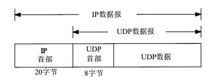
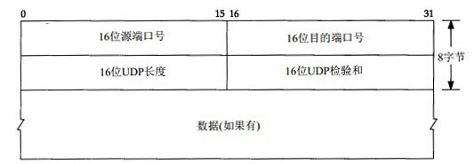
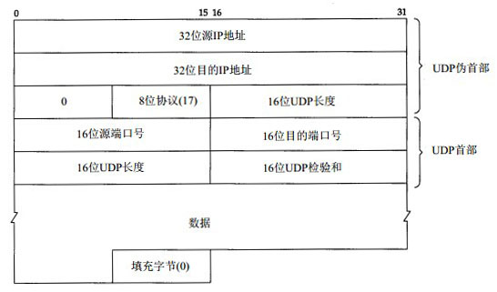
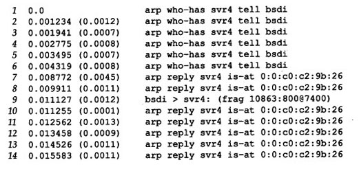

#UDP数据报协议

##UDP协议简介

UDP协议是一个简单的面向数据报的运输层协议，和TCP协议一样，都是工作在传输层上。使用UDP协议进行数据传输的时候，每个进程的输出都正好产生一个UDP数据报，并被放在一个IP数据报中进行传输。

UDP数据报在IP数据报中的封装格式：

UDP数据报协议不提供可靠性，它把应用程序传递给IP层的数据发送出去后，并不保证数据可以顺利的到达对端，这和TCP协议是不同的。

在应用程序使用UDP协议发送数据报的时候，需要考虑到单个UDP数据报的大小，因为由于网络MTU大小的限制，如果一个UDP数据报的报文太大，那么在进行传输的时候，发送端需要对这个大的UDP数据报进行分片处理（当然，除了发送端，在中间路由上，如果对于下一个站点之间的MTU放不下一个UDP数据报，那么也需要进行分片处理），这和TCP协议不同，TCP协议在建立连接的时候就已经通告了双方的MSS大小，这样应用程序在发送数据的时候，报文段的大小不会超过MSS的值。

##UDP首部

UDP首部的格式：

###报文格式字段
* 端口号，2个16bits的端口号字段用于表示发送进程和接收进程，一个UDP通过使用端口号来表示一个服务。而IP地址用于表示一台主机，那么主机上的端口号就可以用来表示主机提供了哪种服务。端口号是由传输层协议处理的，包括TCP和UDP协议，而且TCP协议的端口号和UDP协议的端口号是相互独立的，同一个端口号表示了两种不同的服务。

* UDP长度，16-bits的UDP长度字段用于表示**UDP首部和UDP数据部分的总字节长度**，这个字段的最小值为8，也就是UDP首部的长度为8个字节。UDP的长度字段是冗余的，IP数据报中也有一个数据报长度字段和一个首部长度字段，这个数据报长度字段包括了整个IP数据报的长度，所以通过将IP数据报的总长度字段减去IP首部长度字段，就可以得到IP数据报中数据部分的大小，而UDP是放置在IP数据报的数据部分的，所以这个长度是可以通过这种方式计算出来的。

* UDP检验和，16-bits的UDP检验和字段**覆盖了UDP首部和UDP数据**，这和IP数据报是不同的，IP数据报的检验和字段只是覆盖的IP数据报首部。
    UDP的检验和与TCP的检验和虽然都是覆盖了数据部分和首部，但是TCP的检验和字段是强制要求的，而UDP的检验和字段是可选的。
    UDP的检验和的计算方法和IP数据报中的计算方法类似，但是，有一下一些区别：
    * UDP数据报的长度可以为奇数字节，但是检验和算法是把若干个16-bits字相加，所以为了解	    决这个问题，在必要的时候需要在最后添加0字节进行填充，当然，这些只是为了用于计算    检验和设置的。
    * UDP数据报和TCP数据报在计算检验和的时候，都使用一个长度为12字节的伪首部，它只是用	    于计算检验和。这么做的目的是为了让UDP检查数据是否已经到达了目的主机，其中IP层对I	P数据报进行一次检查，然后将UDP数据报递交给UDP协议处理模块的时候，UDP协议又进行了一次检查。
	UDP数据报伪首部的格式：
			    
    UDP检验和的计算结果如果为0，那么将这个字段的值设置为全为1，即65535。这在二进制反码计算中是等效的。如果传送的检验和字段为0，那么表示没有计算检验和。		    
    如果发送端没有计算检验和，那么如果接收端检测到检验和字段有差错，那么UDP将会把数据报悄悄的丢弃，不会产生任何差错报文。	    
    UDP检验和是一个端到端的检验和计算，通过发送端进行计算，由接收方进行验证。其目的是为了发现UDP首部和数据部分在发送过程中是否有出错。

###UDP和ARP之间的交互作用

UDP和APR协议之间，在实现上会出现一些问题。

通过UDP协议发送一个长度为8192字节数据的UDP数据报，这将会在网络上产生6个数据报片。tcpdump输出如下：

通过查看这个输出结果，发现在第一个ARP应答返回前，总共产生了6个ARP请求。这可能是由于IP很快的产生了6个分片，然后每个分片都导致ARP协议产生了ARP请求。

观察发现，在接收到第一个ARP应答的时候（报文段7），只发送了最后一个数据分片（报文段9），而前面的5个分片并没有被发送。实际上，这是ARP的正常操作，在大多数实现中，在等待一个ARP响应的时候，只是ARP协议将最后发送的一个请求的响应发送给特定的目的主机。这就导致了发送最后一个请求的IP数据报可以发送数据给对端，而其他5个分片就没有被发送，因为ARP请求没有被响应。

> Host Requirements RFC要求实现中必须防止这种类型的ARP泛洪（ARP flooding，即以高速率重复发送到同一个IP地址的ARP请求）。

> Host Requirements RFC规定，ARP应该保留至少一个ARP报文，而这个ARP报文必须是最后一个到达的ARP报文。

如果在最后一个ARP应答到达以后，继续通过tcpdump监听，试图查看是否有ICMP报文“组装超时”差错到达，但是发现并没有出错报文到达，这可能是由于在实现中没有对这个功能的支持。

IP层的重组：在第一个数据分片（第一个数据分片指的是第一个到达的对端的分片，而不是偏移量为0的那个分片）到达的时候，IP层必须启动一个定时器，正常的定时器被设置为30或60秒。如果定时器超时的时候所有的分片还没有到达，那么将这些数据分片丢弃。这么做是为了防止如果分片永远不会到达，那么这个缓冲区迟早会被占满。

对于期望的ICMP报文没有被发送，可能是一下原因造成的：

* 大多数Berkeley派生的实现从不产生该差错，在这些实现里会设置定时器，但是当定时器超时丢弃数据报的时候，不会产生ICMP差错。

* 没有收到偏移量为0的分片，除非收到了偏移量为0的分片，否则实现并不会要求产生ICMP差错，这是因为除了偏移量为0的分片，其他分片都没有传输层的首部，如果对其他的分片产生ICMP差错，那么ICMP差错的接受者无法区分出是哪一个进程所发送的数据报被丢弃。

产生这个问题，除了使用分片来产生这个问题，还可以通过发送多个UDP报文来产生这个问题，但是产生分片的速度比产生UDP报文的速度来的快。

###最大UDP数据报长度

理论上来说，IP数据报的最大长度是65535字节，这是由于IP数据报首部的总长度字段为16-bits，，那么，如果在这个IP数据报中装载了一个UDP数据报文，那么，去除20字节长的IP首部，然后是8个字节长的UDP首部，剩下的留给UDP数据部分的长度为65507个字节。但是大多数实现提供了比这个值小的长度。

造成不能使用理论上的最大值是由于以下的一些限制：

* 应用程序可能会受到其他应用程序接口的限制，套接字API提供了一个可选的接口来设置接收和发送缓冲区的长度，对于UDP而言，这个长度是应用程序可以读写的最大UDP数据报长度。

* TCP/IP协议栈的内核实现对这方面有限制。

####数据报截断

虽然IP能够发送或接收特定长度的数据报，但是应用程序不一定能读取该长度的数据，因此，UDP编程接口允许应用程序指定每次返回的最大字节数，如果收到的数据报长度大于应用程序指定的长度，那么具体的情况取决于实现：

* Berkeley 实现的套接字接口对数据报进行截断，并丢弃多余的数据，而应用程序什么时候被通知，则取决于版本
* SVR4下的套接字API并不截断数据报，超过部分的数据在后面读取的时候返回，但是不通知应用程序需要进行几次读写。
* TLI接口不丢弃数据，相反，它返回一个标志，表明有更多的数据需要被读取。
