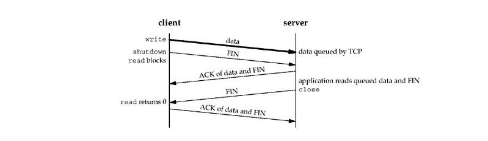
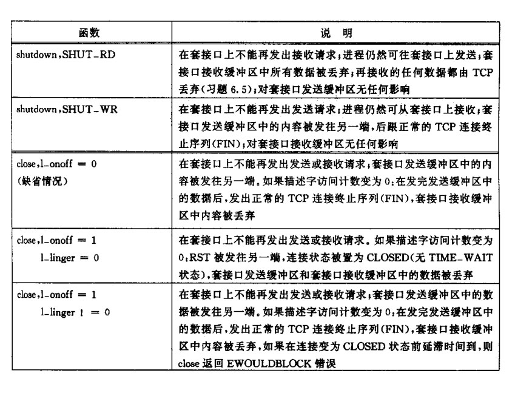

# SO_LINGER 套接字选项

SO_LINGER 选项用于指定套接字上close函数对面向连接协议的行为（主要是TCP协议）。

## 套接字上close操作的默认行为

默认，close函数调用后，立即返回。如果在发送数据缓冲区中包含了未被发送的数据，那么系统将试着把这些数据发送给对端。

如图所示，close操作的默认行为是立即返回，而我们并不知道对端是否已经接收了我们发送过去的数据，而我们不能保证对端已经正确的接收了数据，因为对端可能会在接收缓冲区数据的过程中出问题。

## SO_LINGER 选项

SO_LINGER选项可以修改这种close的默认行为，该选项需要向内核传递一个结构：

    struct linger {
	    int l_onoff;    /* 0 = off, nonzero = on */
	    ibt l_linger;   /* linger time, POSIX specifies units as seconds */
    }

该结构中的两个成员：l_onoff和l_linger的取值组合如下：

* l\_onoff = 0 ：关闭该选项，l_linger的值被忽略。close的行为使用默认的行为。
* l\_onoff = 非0, l\_linger = 0 ：当close某个连接的时候，TCP将立即终止该连接。TCP将会丢去保存在套接字发送缓冲区中的任何数据，并发送一个RST报文给对端，而不是进行正常的4分组终止序列。（这么做，可以避免TCP连接进入TIME_WAIT状态，但是，如果在2MSL内创建了该连接的一个化身，那么可能会接收到来自上一个连接的旧的重复分组）。
* l\_onoff = 非0, l\_linger = 非0 ：当套接字关闭的时候，内核将拖延一段时间。如果套接字的发送缓冲区中还残留了一些数据，那么进程将被挂起，直到如下情况发生：
    * 所有数据都被发送并且**接收到对数据的确认**
    * l_linger设置的延迟时间超时了

    如果套接字被设置为非阻塞的，那么它将不等待close的完成，即使延迟时间被设置为非0。所以，如果使用了套接字选项SO_LINGER，那么应用应该检查close的返回值来确定数据是否是被对端接收，如果是因为延迟时间超时而造成close返回，那么close将返回**EWOULDBLOCK**错误。而且如果超时的时候，套接字缓冲区中包含了残留数据，那么也会被丢弃。

如果我们设置了SO_LINGER选项，那么，我们可以指定一个正的值给l_linger，使得close操作延迟一段时间后返回，如在此期间对端接收并发回了确认，那么close就返回。

但是，虽然我们已经确定对端TCP已经接收了数据，但是，我们不能确定对端应用程序已经读取了TCP缓冲区中的数据。而且，如果我们设置的l_linger的值过小，可能在close返回前超时，那么在我们还没有接收到对端的确认前close就返回了。

在上图中，由于设置了过小的l_linger的值，导致close在等待对端数据的确认的时候超时，这时，close返回-1，并且设置error的值为**EWOULDBLOCK**。

在使用SO_LINGER选项的时候，有一个原则：设置SO_LINGER选项后，close成功返回只是告诉我们先前发送的数据已经被对端的TCP接收，但是不能告诉我们，对端应用程序是否已经读取了这些数据。但是如果我们没有设置这个选项，我们甚至不能知道对端是否接收了我们发送的数据。

如果需要知道对端已经接收并且对端应用程序已经接收了我们发送的数据，可以调用*shutdown*函数来实现。

这里，我们调用*shutdown*函数以后，关闭了套接字的写端，然后这回导致我们发送一个FIN分节到对端，然后对端将接收到FIN分节放到读队列中。于此同时，在发送端调用了shutdown函数后，马上调用read调用，使得进程阻塞在read调用上。当对端应用程序接收了接收缓冲区中的数据以后，会发送一个FIN分节到刚才的发送端，这时，read调用读到EOF，返回0。这个时候，我们就知道对端应用程序已经接收了我们发送过去的数据。

除了使用这种方法来确认对端应用程序已经接收了数据，我们还可以使用应用级的确认（应用ACK）。

在客户端发送完数据以后，再发送一个字节的数据：

    char ack;
    Write(sockfd, data, sizeof data);
    len = Read(sockfd, &ack, 1);

服务器在接收到数据后，发送一个字节的数据来对服务端发送的一个字节进行确认：

    len = Read(sockfd, buff, sizeof buff);
    Write(sockfd, " ", 1);

这么处理，当客户端的read调用返回的时候，我们就知道，用户已经接收了我们发送过去的数据。（这里的前提是，服务端知道我们的应用ACK的长度为1个字节）。

###shutdown的两种可能调用和close的三种可能调用

