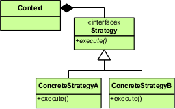

# 策略模式(Strategy) {#strategy}

## OO原则

* 封装变化
* 多用组合，少用继承
* 针对接口编程，不针对实现编程

## 概念

> The Strategy Pattern defines a family of algorithms,encapsulates each one,and makes them interchangeable. Strategy lets the algorithm vary independently from clients that use it.

策略模式定义了一系列的算法，并将每一个算法封装起来，而且使它们还可以相互替换。策略模式让算法独立于使用它的客户而独立变化。

## 组成

**策略（Strategy）**
:   定义了所有支持的算法的公共接口。
    Context使用这个接口来调用某种ConcreteStrategy定义的算法

**具体策略（ConcreteStrategy）**
:   以Strategy接口实现某具体的算法

**上下文（Context）**
:   用一个ConcreteStrategy对象来配置，维护一个对Strategy对象的引用，
    可定义一个接口来让Strategy访问它的数据

## 使用场景
* 许多相关的类仅仅是行为有异。“策略”提供了一种用多个行为来配置一个类的方法。
* 需要使用一个算法的不同变体。
* 算法使用的客户不应该知道的数据，
  可以使用策略模式以避免暴露复杂的、和算法相关的数据结构。
* 一个类定义了多种行为，并且这些行为在这个类的操作中以多个条件语句的形式出现。

## 协作

* Strategy和Context相互作用以实现选定的算法。
  当算法被调用时，Context可以将该算法所需要的所有数据都传递给该Strategy。
  或者，Context可以将自身作为一个参数传递给Strategy。
  这就让Strategy在需要的时候可以回调Context。
* Context将它的用户请求转发给它的Strategy。
  客户通常创建并传递一个ConcreteStrategy对象给该Context。
  这样，客户仅仅与Context交互，通常有一系列的ConcreteStrategy类可以供客户选择。

## 优缺点

### 优点

1.相关算法系列
:   Strategy类层次为Context定义了一系列的可供重用的算法和行为。
    继承有助于析取出这些算法中的公共功能

2.一个替代继承的方法
:   继承提供了一种支持多种算法或行为的方法。
    只需要直接生成一个Context类的子类，从而给他以不同的行为。
    但是这样处理会导致代码的硬编码，将不同的行为硬编码到Context中，
    从而将Context的实现和算法的实现耦合在一起。
    这将会导致Context变得庞大，难以理解和维护，并且不能动态的更改算法的实现，
    最后你得到了一堆相关的类，它们之间的区别仅仅是行为不同。
    将算法封装在独立的Strategy类中，使得你可以独立于Context来改变Strategy的行为，
    使得不同的算法或行为可以便于扩展的替换。

3.消除一些条件语句
:   Strategy模式提供了替代条件语句选择不同的行为这一种需求的另一种实现方式。
    当将不同的行为堆砌在一个类中时，很难避免使用条件语句来进行选择合适的行为，
    当将这些行为封装在一个个独立的Strategy类中时，可以用于消除这些条件语句
    含有很多条件语句的代码，意味着，可能需要使用Strategy模式。

4.实现的选择
:   Strategy模式可以提供相同的行为的不同的实现。
    客户可以根据不同时间和空间来权衡取舍不同的策略。

### 缺点

1.客户必须了解不同的Strategy
:   策略模式存在一个潜在的缺点，
    就是每个客户如果要选择一个合适的Strategy就需要知道这些Strategy的具体的功能。
    此时，可能不得不向客户暴露具体的实现问题。
    因此，只有当这些行为是和客户相关的时候，才适合使用策略模式（因为这些行为本来就是客户所知道的）。

2.Strategy和Context之间的通信开销
:   无论各个ConcreteStrategy实现的算法是简单还是复杂，它们都共享Strategy定义的接口。
    但是很可能某些ConcreteStrategy不会用到所有通过这些接口传递过来的信息。
    这就意味着有时候Context会创建和初始化一些永远用不到的参数。
    当出现这种问题的时候，那么就需要在Strategy和Context之间进行更加紧密的耦合。

3.增加对象的数目
:   Strategy增加了一个应用中的对象的数目。
    有时候可以通过将Strategy实现为可以供各个不同的Context共享的无状态的对象来避免这个问题。
    任何其余的状态都由Context来进行维护。Context在每一次对Strategy对象的请求中都将这个状态传递过去。
    共享的Strategy不应该在各次调用之间维护状态（这个相当于系统调用中的可重入问题）。

## 实现
### Java 实现

~~~java

public class Context {
    private Strategy strategy;
    
    public Context(Strategy strategy) {
        this.strategy = strategy;
    }
    
    public void setStrategy(Strategy strategy) {
        this.strategy = strategy;
    }
    
    public void execute() {
        strategy.execute();
    }
    
    public static void main(String[] args) {
        Strategy strategy = new ConcreteStrategyOne();
        Context context = new Context(strategy);
        
        context.execute();
        context.setStrategy(new ConcreteStrategyTwo());
        context.execute();
    }
}

interface Strategy {
    public void execute();
}

class ConcreteStrategyOne implements Strategy {
    @Override
    public void execute() {
        System.out.println(getClass().getName() + "execute");
    }
}

class ConcreteStrategyTwo implements Strategy {
    @Override
    public void execute() {
        System.out.println(getClass().getName() + "execute");
    }
}

~~~

### Python 实现

~~~python

#-*- coding: utf-8 -*-

class Context(object):
    ''' Context '''

    def __init__(self, behavior):
        self.behavior = behavior

    def execute(self):
        self.behavior.execute()

    def setBehavior(self, behavior):
        self.behavior = behavior

class Strategy(object):
    ''' Strategy '''

    def __init__(self):
        pass

    def execute(self):
        pass

class ConcreteStrategyOne(Strategy):
    ''' ConcreteStrategyOne '''

    def __init__(self):
        pass

    def execute(self):
        print("ConcreteStrategyOne execute")

class ConcreteStrategyTwo(Strategy):
    ''' ConcreteStrategyTwo '''

    def __init__(self):
        pass

    def execute(self):
        print("ConcreteStrategyTwo execute")

if __name__ == '__main__':
    strategy = ConcreteStrategyOne()
    context = Context(strategy)
    context.execute()

    context.setBehavior(ConcreteStrategyTwo())
    context.execute()

~~~

