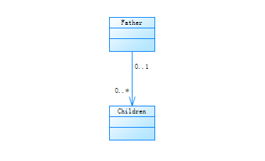
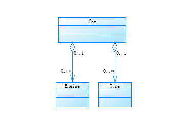
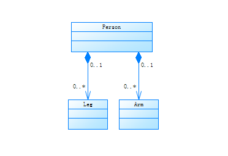
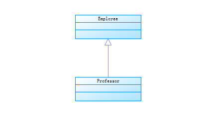
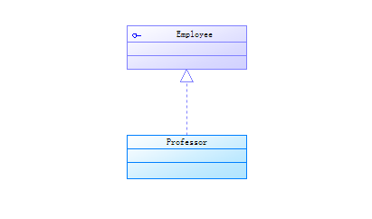

# UML类图符号

## 概念

UML中描述对象和类之间的相互关系的主要方式包括：

* 依赖（Dependency）：
  元素A的变化会影响元素B，但反过来不成立，那么则称B和A的关系是依赖关系，B依赖A。
  类属关系和实现关系在语义上都是依赖关系，但是由于实现关系具有更加特殊的用途，
  所以被单独描述。UML图中采用带箭头的虚线来表示Dependency关系，箭头指向被依赖的元素。

* 关联（Association）：
  元素间的结构化关系，是一种弱关系，被关联的元素间通常可以被独立的考虑。
  UML图中用带箭头的实线表示Association关系，箭头指向被依赖的元素。

* 聚合（Aggregation）：
  关联关系的一种特例，表示部分和整体的关系。
  UML中有带空心菱形和箭头的实线表示Aggregation关系，箭头指向被依赖的元素。

* 组合（Composition）：
  组合关系是聚合关系的变种，表示元素间更强的组合聚合关系。
  如果是组合关系，那么当整体被破坏的时候，个体也一定会被破坏，
  而聚合关系中，个体可能会被多个整体所共享，不一定会随着某个整体的破坏而被破坏。
  UML图中用带实心菱形和箭头的实线表示Composition关系，箭头指向整体。

* 泛化（Generalization）：
  泛化关系就是通常所说的继承关系。
  UML中用带箭头的实线表示Generalization关系，箭头指向一般个体。

* 实现（Realization）：
  元素A定义了一个约定，元素B实现这个约定，则B和A的关系就是实现关系。
  这个关系最常用于接口。UML中有空心箭头和虚线表示Relization关系，
  箭头指向定义约定的元素。

其中依赖（Dependency）的关系最弱，而关联（Association），聚合（Aggregation），组合（Composition）表示的关系依次增强。换言之关联，聚合，组合都是依赖关系的一种，聚合是表明对象之间的整体与部分关系的关联，而组合是表明整体与部分之间有相同生命周期关系的聚合。

而关联与依赖的关系用一句话概括下来就是，依赖描述了对象之间的调用关系，而关联描述了对象之间的结构关系。

## 描述

### 依赖关系（Dependency）

* 依赖关系是类和类之间的联结
* 依赖总是单向的
* 依赖关系在Java或C++中，表现为局部变量的使用、方法参数的传递或者对静态方法的调用

当类和类之间有使用关系的时候，就属于依赖关系，不同于关联关系，依赖关系没有“拥有关系”，仅仅是一种“相识关系”，只是在某个特定的地方才有关系，比如通过参数传递到方法体内后。

~~~

class Person {
    public void buyCar(Car car) {}
}

class Car {}

~~~

### 关联关系（Associate）

* 关联关系是类和类之间的联结，它使得一个类知道另一个类的属性和方法
* 关联可以是双向的，也可以是单向的，甚至可以自己关联自己
* 在Java或C++中，关联关系是通过使用成员变量来实现的

关联关系表示类与类或者类与接口之间的依赖关系，表现为“拥有关系”，在代码中可以通过成员变量引用一个类实例来实现。

~~~

class Father {
    private Children children;
}

class Children {}

~~~

### 聚合关系（Aggregation）

* 聚合关系是关联关系的一种，是强关联的关系
* 聚合是整体和部分之间的关系，比如汽车和它的零件之间的关系
* 聚合关系也是通过成员变量来实现的，但是关联关系所涉及的两个类处在同一个层次上，
  而聚合关系中，两个类处在不同的层次上，一个代表整体，一个代表部分。
* 关联和聚合关系在实现上不容易区分，需要从逻辑关系上进行区分。

聚合关系是关联关系的一种特例，体现了整体和部分之间的关系，是一种弱拥有关系，整体和部分可以有不一样的生命周期，是一种弱关系。

~~~

class Engine {}

class Tyre {}

class Car {
    public Engine engine;
    public Tyre tyre;
}

~~~

### 合成关系（Composition）

* 合成关系是关联关系的特例，是比聚合关系还要强的关系
* 它要求普通的聚合关系中代表整体的对象负责代表部分的对象的生命周期

属于关联关系的特例，也体现了整体和部分的关系，是一种“强拥有关系”。整体和部分之间拥有相同的生命周期，是一种强关联。

~~~

class Person {
    public Leg leg;
    public Arm arm;
}

class Leg {}

class Arm {}

~~~

### 泛化关系（Generalization）

泛化关系表示一个泛化元素和一个具体的元素之间的关系。泛化关系表示类与类之间的继承关系，接口和接口之间的基础关系。

~~~

abstract class Employee {}

class Professor extends Employee {}

~~~

### 实现关系（Relization）

实现关系是指两个实体之间的一个合同，一个实体定义了一个合同，另一个实体保证履行合同。

~~~

interface CollegePerson {}

class Professor implements CollegePerson {}

~~~
