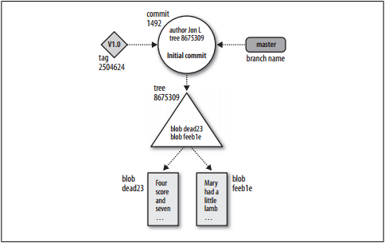
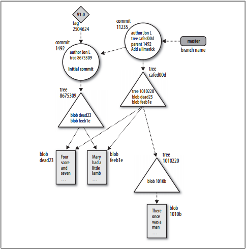

# Repositories {#repositories}

Git仓库(repository)，就是一个包含了所有用于管理项目修订记录和历史信息的数据库。和其他版本控制系统一样，一个仓库保留了当前项目的一份拷贝。但是，Git和其他的版本控制系统不同的地方在于，Git不只是保存了当前项目所有文件的拷贝，还包含了仓库自身的拷贝。

Git为每一个仓库维护了一系列的配置信息。这些配置信息比较特殊，它们并不像文件数据和其他仓库的元数据一样，在拷贝或者clone的时候被复制。相反，Git为每一个站点(site)，每一个用户和每一个仓库都维护了一份配置信息。(对应于命令 *git config* 中的 *--system -- global --file* )

在一个仓库中，Git维护两种原始数据类型，一种是对象仓库(object store)，还有一种是索引(index)。这些数据都存储在工作目录下的隐藏文件夹 *.git* 中。

对象仓库(object store)在设计的时候，考虑到在进行clone操作的时需要进行高效的复制。而索引(index)是一种临时性的信息，对于仓库来说是私有的，并且可以在需要的时候进行修改和创建。

# Git对象类型 {#git_object_types}

Git仓库的核心是对象仓库(object store)。对象仓库中包含了所有的原始数据文件和所有的日志信息，作者信息以及其他的一些重建版本所需要的信息。

Git在对象仓库中只包含了4中类型的对象： *blobs* ， *trees* ， *commits* 和 *tags* 。这4中类型的原子对象是Git高级数据结构的基础。

Blobs
:   每个版本的文件被表示成一个 *blob* 。Blob是指一团缩紧的二进制对象，用于表示一些变量或者文件，这些变量或文件内部的结构被忽略。一个 *blob* 包含了文件的数据，但是不包含文件的任何元数据，即使是文件名。

Trees
:   一个 *tree* 对象代表一层目录的信息。 *tree* 对象存储了 *blob* 对象的标识符，路径信息，和该目录下所有文件的元数据。 *tree* 对象可以递归的引用子目录对应的 *tree* 对象，所以，可以通过 *tree* 对象和 *blob* 对象来构成一个完整的目录体系。

Commits
:   一个 *commit* 对象包含了用于向一个仓库提交数据所需要的所有元数据。包括作者，提交者，提交日期，日志信息。每个 *commit* 对象指向一个获得了当前所有需要提交的数据的 *tree* 对象。对于一个初始 *commit* 对象，或者称为根提交对象( *root commit* )，没有父亲节点。除了这个根对象，其他的 *commit* 对象都有一个父节点。

Tags
:   一个 *Tag* 对象，可以用任何人类可读的信息对一个特殊到对象进行命名，一般来说，是对 *commit* 对象进行命名。虽然hash码( *9da581d910c9c4ac93557ca4859e767f5caf519* )可以用于引用一个 *commit* 对象，但是一个更加友好的名字，比如 Ver-1.0-Alpha更加有意义。

# 索引(Index) {#index}

Index是一个临时的二进制文件，用于描述当前的目录结构和整个仓库。Index实时得描述了项目当前版本总的结构。一个项目得状态可以从一个存在于项目历史中的提交对象和对应的tree对象中获得，也可以是一个正在开发，还没有提交到仓库的状态，而这些状态，都是通过index来描述的。

Git采用index的方案的好处是，index允许有条不紊的对index的内容进行修改，index把不断推进的开发进程和对修改的提交划分开来。

Index是这样工作的：当一个开发者，执行Git命令将修改暂存(stage)到index中，由于修改可能是添加或者删除，异或是编辑某些文件。index记录并且保存了这些修改，保证这些修改在进行提交前都安全。你可以对index中保存的修改信息进行删除和替换，因此，index中为一个好的提交进行一个平滑的过渡，而这一切都是用户引导的，把仓库从一个复杂的状态转移到另一个状态。

Index中描述的是Git当前的状态，而当Git需要提交的时候，就将当前index中的状态转换到一个commit对象并保存下来。

# 内容可寻址命名 {#content_addressable_names}

Git的对象仓库(store)是作为一个内容可寻址系统(content-addressable storage system)进行组织和实现的。对象仓库中的每个对象都有一个独一无二的名字，这个名字通过对对象的内容进行 *SHA1* 计算得到，产生一个 *SHA1* hash码。由于 *SHA1* 的特性，导致不同内容的对象将会产生不同的hash码，所以可以将这个hash码值作为对象在对象数据库中的名字。

SHA1产生的hash值是一个160位的二进制值，一般将这个hash值表示成40位的16进制值。比如 *9da581d910c9c4ac93557ca4859e767f5caf519*  。

# Git跟踪内容 {#git_tracks_content}

Git是一个内容跟踪系统(*content tracking system*)，这和其他的版本控制系统存在很大的差别。这个差别，虽然微妙，但是却引导了Git的设计方向，并且很可能是Git可以方便对内部数据进行维护的关键原因。

Git的内容跟踪是通过两种方式进行维护的，这两种方式体现了和其他版本控制系统最基本的差别。

首先，Git的对象仓库是基于对对象的内容进行哈希计算的基础上的，而不是基于文件名和目录名。因此，当Git把一个文件放到对象仓库中的时候，是基于对文件内容进行计算得到的哈希值，而不是这个文件的文件名。实际上，Git没有对文件名和目录名进行跟踪，对于文件名和目录名，采用的其他的方式进行关联。

如果两个名字不同的文件包含的内容相同，即使是在不同的文件夹中，Git只会存储一份拷贝，把它存储在glob对象中。因为是基于对内容的哈希，所以这两个文件具有相同的哈希值，那么表示具有相同的内容，所以只需要保留一份拷贝就可以了。所以，在一个项目中，如果存在内容相同的两个文件，那么，在仓库中只会保留一份拷贝，无论这两个文件是不是在同一个目录下。

如果这两个文件中的其中一个文件被修改了，那么内容被改变以后，Git会重新计算这个被修改的文件的哈希值，如果不同，则会把这个文件存储到另外的一个blob对象中。

其次，Git的内部数据库高效的存储每个文件的每一个版本，而不是存储这些文件的版本之间的差异部分。因为Git采用从文件内容计算得来的哈希值作为glob对象的名字，所以它必须为每一个版本的完整的文件上进行操作，而不是在差异部分上进行操作。

# Pack文件 {#pack_files}

Git中采用了一种高效的存储机制，称为Pack文件(pack file)。为了创建一个pack文件，Git首先查找内容相近的文件，然后对其中的一个文件进行存储，然后Git把这些文件和存储的文件进行差异计算。并把这些文件和差异数据都存储在pack文件中。

Git在创建pack文件的时候，采用非常智能的算法。由于Git是以内容驱动的，所以Git并不关心参与计算的那两个文件是否是来自同一个文件的不同版本，Git会对在仓库中的任意两个文件类似的文件进行差异计算。因此，Git可以通过一个文件产生一系列的差异文件。

Git同时也在pack文件中维护了每个原始文件的哈希值(如果是一个差异文件，则会把这个差异数据和对比的那个文件合并后产生的新文件的哈希值保存下来)。这是保证index机制可以对pack中的对象进行定位的基础。

Pack文件存储在对象仓库中，和其他对象独立存放。可以用于在网络中高效的传输。

# 对象仓库图示 (#object_store_picture)

下面的图片展示了Git中的对象是怎样存储和关联的。

其中，blob对象处在数据结构的最底层，blob对象只会被tree对象引用。

tree对象指向blob对象，也会指向tree对象，如果存在子目录的话。任何的tree对象都会被许多不同的commit对象引用。

一个commit对象指向一个tree对象，这个别引用的tree对象通过这个commit，被引入到Git仓库中。

tag对象指向commit对象，并且每个tag最多指向一个commit对象。

下面的图片展示了，当进行一次提交以后的对象关系。

由于blob *dead23* 和 *feed1e* 的内容并没有被改变，所以，在第二次提交的时候，Git意识到这两个文件并没有被修改，所以不会对这两个文件产生一个新的副本，而是直接将新的tree对象 *cafed00d* 指向这两个文件。

从图中可以发现，每个commit对象都指向它的前一个commit对象。

# 概念在Git的实际应用 {#git_concept_at_work}

## .git目录

git的目录结构大致上如下(不同版本的可能会有差异)：

~~~

$ mkdir /tmp/hello
$ cd /tmp/hello
$ git init
Initialized empty Git repository in /tmp/hello/.git/
# List all the files in the current directory
$ find .
.
./.git
./.git/hooks
./.git/hooks/commit-msg.sample
./.git/hooks/applypatch-msg.sample
./.git/hooks/pre-applypatch.sample
./.git/hooks/post-commit.sample
./.git/hooks/pre-rebase.sample
./.git/hooks/post-receive.sample
./.git/hooks/prepare-commit-msg.sample
./.git/hooks/post-update.sample
./.git/hooks/pre-commit.sample
./.git/hooks/update.sample
./.git/refs
./.git/refs/heads
./.git/refs/tags
./.git/config
./.git/objects
./.git/objects/pack
./.git/objects/info
./.git/description
./.git/HEAD
./.git/branches
./.git/info
./.git/info/exclude

~~~

可以看出，Git的.git目录包含了很多内容。一般情况下，不需要关系.git目录的内容，这些隐藏文件是Git底层(plumbing)实现和配置的一部分。Git提供了一些底层的命令来维护这些隐藏文件。

在初始化以后，.git/objects目录(这个目录用于存储Git的所有对象)是空的。

~~~

$ find .git/objects
.git/objects
.git/objects/pack
.git/objects/info

~~~

如果现在添加一个简单的对象：

~~~

$ echo "hello world" > hello.txt
$ git add hello.txt

~~~

可以看到，.git/objects目录下已经出现了刚才添加进去的对象了：

~~~

$ find .git/objects
.git/objects
.git/objects/pack
.git/objects/3b
.git/objects/3b/18e512dba79e4c8300dd08aeb37f8e728b8dad
.git/objects/info

~~~

# Objects & Hashes & Blobs {#object_hash_blob}

当Git为一个文件创建了一个blob对象，Git并不关心文件名是什么，Git只关心在这个文件中的内容。Git对这个创建的blob对象进行SHA1计算得到哈希值，作为这个blob在对象仓库中的名字。

在上面的例子中，文件 *hello.text* 的哈希值是 *3b18e512dba79e4c8300dd08aeb37f8e728b8dad* ，Git在 *.git/objects* 目录下存储这个对象的时候，取出哈希值的开头1个字节（也就是上面哈希值的16进制的前两位），作为子目录的目录名，然后把剩下的字节作为对象的名字存储在这个子目录下，这样有利于一些文件系统提高工作的效率。

通过哈希值可以查看存储的对象的内容：

~~~

$ git cat-file -p 3b18e512dba79e4c8300dd08aeb37f8e728b8dad

hello world

~~~

Git为了方便对复杂的哈希值进行操作，提供了一个命令用于根据一个独一无二的前缀来推出对象完整的哈希值：

~~~

$ git rev-parse 3b18e512d

3b18e512dba79e4c8300dd08aeb37f8e728b8dad

~~~

# 文件和Tree对象 {#file_tree}

对于Git中存储的文件，文件的内容被存储在blob对象中，而对象的名字不是文件名，而是根据内容计算得到的哈希值。而文件原来的文件名，则是存储在tree对象中。Git通过tree对象来跟踪文件的文件名和路径。

当用户通过命令 *git add* 添加文件的时候，Git会立即为每一个加入的文件创建一个blob对象，但是，Git不会立即创建tree对象，相反，Git会立即更新index，index存储在 *.git/index* 中，并且index会跟踪文件的文件名和路径，已经对应的blob对象。每次只需Git的有关对文件操作的命令，比如 *git add，git rm，git mv* ，Git会更新index。

任何时候都可以根据当前的index来创建出一个tree对象，这个tree对象包含了当前index中所有信息的一个镜像。Git提供了底层命令 *git write-tree* 来实现这个功能。

在上面的例子中，git的index中现在只包含了一个文件，hello.txt

~~~

git ls-files -s

100644 3b18e512dba79e4c8300dd08aeb37f8e728b8dad 0 hello.txt

~~~

然后，根据当前的这个index，创建一个tree对象：

~~~

$ git write-tree
68aba62e560c0ebc3396e8ae9335232cd93a3f60

~~~

查看.git/objects这个目录，可以看到创建的tree对象 *<68aba62e560c0ebc3396e8ae9335232cd93a3f60>* 

~~~

$ find .git/objects
.git/objects
.git/objects/68
.git/objects/68/aba62e560c0ebc3396e8ae9335232cd93a3f60
.git/objects/pack
.git/objects/3b
.git/objects/3b/18e512dba79e4c8300dd08aeb37f8e728b8dad
.git/objects/info

~~~

由于tree对象也是一个对象，所以可以用命令查看这个对象：

~~~

$ git cat-file -p 68aba6
100644 blob 3b18e512dba79e4c8300dd08aeb37f8e728b8dad hello.txt

~~~

其中，第一个字段 *100644* 表示文件属性，用8进制表示，相当于Unix下的文件权限。然后是对象的类型，这里是blob类型，然后就是对象的哈希值，最后是文件名。

# tree层次 {#tree_hierarchies}

当Git处理目录的时候，如果不同的目录中包含了相同内容的文件，那么Git会只保留这份文件的一份副本，然后让不同的tree对象来引用这个唯一的副本，这是Git采用内容寻址的好处。

# Commit对象

Git提供了一个底层的命令来创建commit对象来进行提交操作

~~~

$ echo -n "Commit a file that says hello\n" \
    | git commit-tree 492413269336d21fac079d4a4672e55d5d2147ac

3ede4622cc241bcb09683af36360e7413b9ddf6c

~~~

可以通过命令 *git cat-files* 来查看创建的commit对象

~~~

$ git cat-file -p 3ede462

tree 492413269336d21fac079d4a4672e55d5d2147ac
author Jon Loeliger <jdl@example.com> 1220233277 -0500
committer Jon Loeliger <jdl@example.com> 1220233277 -0500
Commit a file that says hello

~~~

从中可以发现，在Git的commit对象中，包含了上面创建的tree对象<*492413269336d21fac079d4a4672e55d5d2147ac*>，这就导致了，不同的commit对象，可能会引用同一个tree对象（只要这个tree对象对应的内容没有被更新过），所以，当进行提交的时候，只要把修改的那些tree对象进行拷贝就可以了，这是一个挺小的开销。

在使用Git的时候，一般都是用相对高级的命令 *git commit* 来代替底层的命令 *git write-tree * 和 *git commit-tree* 。

可以通过命令 *git show --pretty=fuller* 来查看提交的详细信息。

Git对象被存储在图结构中，这和tree对象采用的数据结构是不同的。每次创建一个新的commit对象的时候，都会赋值以一个父对象，这样，将不同的commit对象连接起来，就可以回溯到任何一个历史提交对象上去。

# Tag对象 {#tags}

Git只实现了一种tag对象，但是这种tag对象的基本类型有两种：轻量级(lightweight)标签和注解(annotated)标签。

轻量级标签只是简单的引用一个commit对象，这中类型的标签用于仓库的内部维护。这种类型的tag对象并不在对象仓库中创建一个新的对象。一个注解标签会在对象仓库中创建一个对象，注解标签对象中包含了用户给出的信息，并且可以用GnuGPG进行数字签名。

对于提交对象，Git在对待轻量级和注解标签的名字的时候是公平的。但是，Git的很多命令只处理注解标签。

创建一个注解标签，带有一些信息：

~~~

$ git tag -m"Tag version 1.0" V1.0 3ede462

~~~

可以通过下面的命令来查看这个注解标签对象，而标签对象对应的哈希值可以通过命令 *rev-parse* 根据标签名得到：

~~~

$ git rev-parse V1.0
6b608c1093943939ae78348117dd18b1ba151c6a

$ git cat-file -p 6b608c
object 3ede4622cc241bcb09683af36360e7413b9ddf6c
type commit
tag V1.0
tagger Jon Loeliger <jdl@example.com> Sun Oct 26 17:07:15 2008 -0500
Tag version 1.0

~~~
