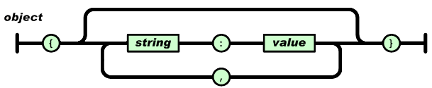
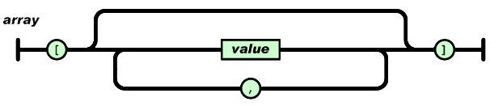
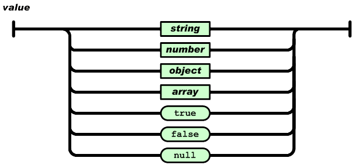
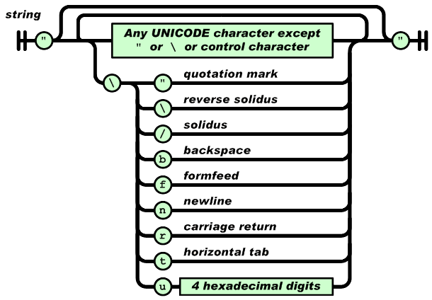
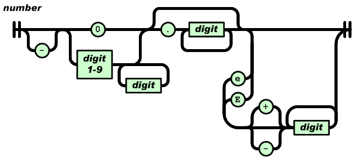

# JSON

## 简介

JSON(Java Script Object Notation) 是一种轻量级的数据交换格式。json既易于阅读和书写也易于计算机的解析和生成。json是基于JavaScript的一个子集被创造出来的。

JSON采用文本格式，并且完全独立于编程语言，json的语法类似C。这些属性使得json成为一种数据交换语言。

JSON由两种数据结构构建：

* 一种收集键值对的集合，在编程语言中，一般可以是一个object，record，struct，dictionary，hash table，keyed list或者associative array。
* 一种包含值的有序列表，在编程语言中一般可以是一个array，vector，list，sequence。

这些都是通用的数据结构，现代的编程语言都以某种形式进行支持。

## 数据结构

### object

一个object就是一个无序的集合，集合中包含了键值对，键是一个字符串。

一个object以如下的形式组织：

~~~

{key1 : value1, key2 : value2, ...}

~~~

### array

一个array就是一个有序的值的集合：

~~~

[value1, value2, value3, ...]

~~~

### value

一个value可以是一个由双引号包裹的字符串，一个数字，布尔值true，false，或者是空值null，甚至是object或array。

~~~

{
    "name" : "Your Name",
    "age" : 100,
    "hobby" : ["reading", "basketball", "football"]
}

~~~

### string

一个字符串就是被双引号包裹，由0或Unicode字符组成的序列。在引号中，通过反斜杠进行转义。单个字符就是一个只包含一个字符的字符串。

转义字符

---    ----------------------
"      quotation mark
\\     reverse solidus
/      solidus
b      backspace
f      formfeed
n      newline
r      carriage return
t      horizontal tab
u      4 hexadecimal digits
---    ----------------------

###number

number的格式和C很类似，除了没有八进制和十六进制的形式。

